# Reproduction of *[Image Generation from Sketch Constraint Using Contextual GAN](https://arxiv.org/abs/1711.08972)*

## Introducation

This repo contains implementation in Tensorflow version and experimental results of ***Image Generation from Sketch Constraint Using Contextual GAN*** which was accepted by ECCV 2018.

I conducted reasearch regarding image generation based on GAN since June 2019, and under the instruction of [Prof. Chengying Gao](http://sdcs.sysu.edu.cn/content/2537). During the period, I laid my emphasis on sketch-to-image generation and managed to train different models, such as [pix2pix](https://github.com/phillipi/pix2pix), [SketchyGAN](https://github.com/wchen342/SketchyGAN), on my self-built dataset that crawled from ImageNet. 

As a comprehensive evaluation of our performance in Software Engineering Training course, our task is to reproduce this paper and verify the results on part of the dataset mentioned in the paper. In the meantime, I explored this issue further and choosed it as my final project of Introduction of Data Mining course. As a result, I refactored the code and put the core part of it in my coursework repository.

------


## Abstract

Freehand sketch can be highly abstract (examples in the first row of picture below), and learning representations of sketches is not trivial. In contrast to other cross domain learning approaches, like [pix2pix](https://phillipi.github.io/pix2pix/), where a mapping from representations in one domain to those in another domain is learned using translation networks based on conditioanl GAN (results shown in the sencond row of picture below). However, the sketch-to-image generation uses sketch as weak constraint, where the output edges do not necessarily follow the input edges. They realized that by using a novel joint image completion approach, where the sketch provides the image context for completing, or generating the output image (results shown in the third row of picture below). They trained the Contextual GAN to learn the joint distribution of sketch and the corresponding image by using joint images.

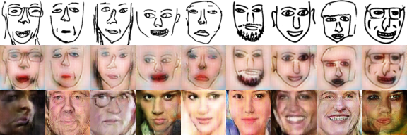


From the comparion above, the Contextual GAN has several benefits:

1. The simple joint image representation allows for simple and effective learning of joint distribution in the same image-sketch space, which avoids complicated issues in crossdomain learning.
2. The generated features exhibit more freedom in appearance and do not strictly align with the input features as previous conditional GANs do. 
3. From the joint image’s point of view, image and sketch are of no difference, thus exactly the same deep joint image completion network can be used for image-to-sketch generation.

------


## Dataset Preparation 

1. Download 202599 face images from align&cropped images folder in [Large-scale CelebFaces Attributes (CelebA) dataset](http://mmlab.ie.cuhk.edu.hk/projects/CelebA.html)

2. Crop and align the face region using OpenFace dlib (datasets/opendlib.py)

3. Resize the images to 64x64 refer to the paper defined (datasets/resize.py)

4. Conduct XDoG edge detection to produce sketch (datasets/xdog.py)

5. Generate pairs refer to the python script provided by [pix2pix](https://github.com/phillipi/pix2pix/blob/master/scripts/combine_A_and_B.py) which combines sketch with image into one pair that has size of 64x128

6. split the dataset into train and test subsets

  

------


## Network Architecture

Define generator network of Contextual GAN refer to [DCGAN-tensorflow](https://github.com/carpedm20/DCGAN-tensorflow/blob/e30539fb5e20d5a0fed40935853da97e9e55eee8/model.py#L214) 

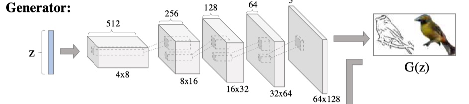

```python
# use five up-convolutional layers with kernel size 5 and stride 2
# a batch normalization layer after each up-convolutional layer except the last one to accelerate the training and stabilize the learning
# The leaky rectified linear unit (LReLU) activation is used in all layers
# tanh is applied in the output layer
def generator(self, z):
        
        self.z_, self.h0_lin_w, self.h0_lin_b = linear(z, self.gf_dim*8*4*8, 'g_h0_lin', with_w=True)
        
        self.h0 = tf.reshape(self.z_, [-1, 4, 8, self.gf_dim*8])
        h0 = tf.nn.relu(self.g_bn0(self.h0))

        self.h1, self.h1_w, self.h1_b = conv2d_transpose(h0,
            [self.batch_size, 8, 16, self.gf_dim*4], name='g_h1', with_w=True)
        h1 = tf.nn.relu(self.g_bn1(self.h1))

        h2, self.h2_w, self.h2_b = conv2d_transpose(h1,
            [self.batch_size, 16, 32, self.gf_dim*2], name='g_h2', with_w=True)
        h2 = tf.nn.relu(self.g_bn2(h2))

        h3, self.h3_w, self.h3_b = conv2d_transpose(h2,
            [self.batch_size, 32, 64, self.gf_dim*1], name='g_h3', with_w=True)
        h3 = tf.nn.relu(self.g_bn3(h3))

        h4, self.h4_w, self.h4_b = conv2d_transpose(h3,
            [self.batch_size, 64, 128, 3], name='g_h4', with_w=True)

        return tf.nn.tanh(h4)
```

Define discriminator network of Contextual GAN refer to [DCGAN-tensorflow](https://github.com/carpedm20/DCGAN-tensorflow/blob/e30539fb5e20d5a0fed40935853da97e9e55eee8/model.py#L186) 

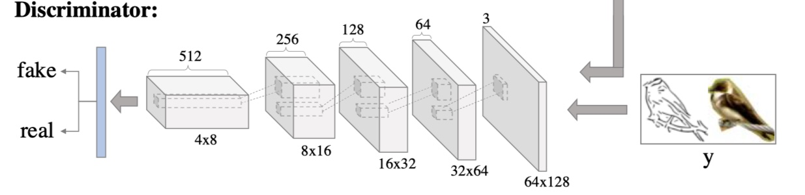

```python
# add 4 convolutional layers with kernel size 5 and stride 2
# a fully connected layer to reshape the output to one dimension
def discriminator(self, image, reuse=False):
        if reuse:
            tf.get_variable_scope().reuse_variables()

        h0 = lrelu(conv2d(image, self.df_dim, name='d_h0_conv'))
        
        h1 = lrelu(self.d_bn1(conv2d(h0, self.df_dim*2, name='d_h1_conv')))
        h2 = lrelu(self.d_bn2(conv2d(h1, self.df_dim*4, name='d_h2_conv')))
        h3 = lrelu(self.d_bn3(conv2d(h2, self.df_dim*8, name='d_h3_conv')))

        h4 = linear(tf.reshape(h3, [self.batch_size, -1]), 1, 'd_h4_lin')

        return tf.nn.sigmoid(h4), h4
```

------


## Train

First update D network, and then update G network

| hyper-parameter       | value  |
| --------------------- | ------ |
| learning rate         | 0.0002 |
| beta (Adam optimizer) | 0.5    |
| batch size            | 64     |
| epochs                | 50     |

------


## Test

According to Contextual GAN pipeline, after getting trained generator and discriminator, to get the closest mapping of the corrupted joint image (input sketch) and the reconstructed joint image (generated sketch), we need to search for a generated joint image G(z^) in which the sketch portion best resembles the input sketch. This can be completed in 2 steps.

The first step is the **Refined initialization of z**:

Sample N uniformly random noise vectors, and obtain their respective initialized sketches via the forward pass. Then we compute the pairwise KL-divergence between the input sketch and these N initialized sketches. The one which gives the lowest KL-divergence represents the best initialization among the N samples and will be used as the initialized sketch. We set N = 30 in our implementation. (red box represents better initialization based on KL-divergence)


The second step is the **Completion**:

Given the better initialization B obtained before, we use back propagation on the loss defined as the weighted sum of **Perceptual Loss** and **Contextual Loss**:

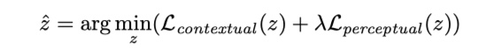

to map the corrupted image A to the latent space (input z is updated while the G & D network are fixed). The mapped vector is then passed through the G network to generate the missing image C.


| hyper-parameter | value |
| --------------- | ----- |
| λ               | 0.01  |
| momentum        | 0.9   |
| iterations      | 1000  |
| learning rate   | 0.01  |

------


## Experimental Results

Train [Image-to-Image Translation (pix2pix)](https://github.com/phillipi/pix2pix) model on the same training set.

1000 test image results see [results/](results/)


Groundtruth

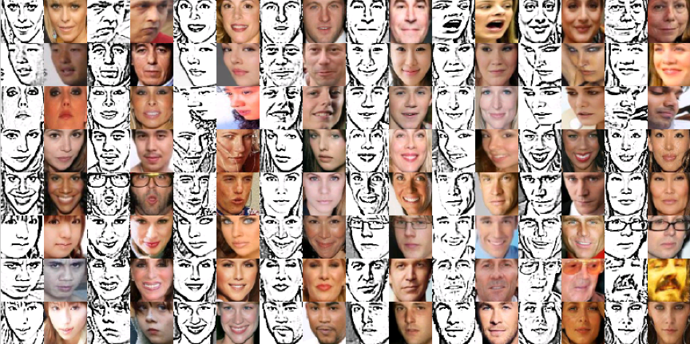


Refined initialization G(z)


Contetual GAN (Completion G(z^) )

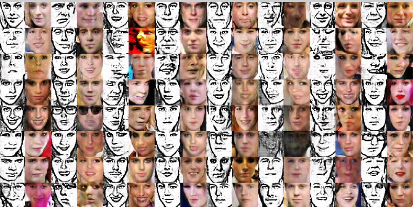


pix2pix

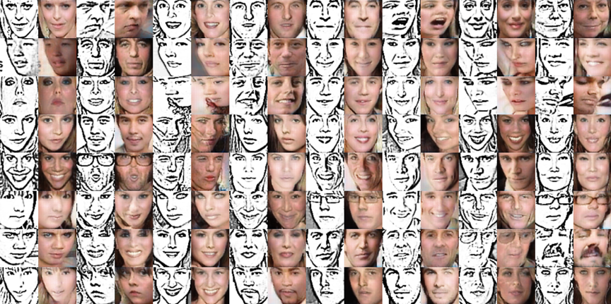


Comparison with pix2pix on ugly hand-drawn sketches (second row is pix2pix, third row is Context GAN)


------


## Quantitative Evaluation

Conducted two quantitative experiments on images generated from XDoG style sketches. (evaluation/evaluation.py)

Both SSIM (Structural Similarity Metric) and PSNR (Peak signal-to-noise ratio) are evaluated on CelebA with 1000 test images.

|                  | SSIM       | PSNR      |
| ---------------- | ---------- | --------- |
| pix2pix          | 0.85480366 | 8.992791  |
| Contextual   GAN | 0.60475737 | 14.746771 |

------


## Analysis of Adversarial Loss

```python
  # cross entropy loss
  self.g_loss = tf.reduce_mean(
    tf.nn.sigmoid_cross_entropy_with_logits(logits=self.D_logits_fk,
                                            labels=tf.ones_like(self.D_fk)))
  self.d_loss_real = tf.reduce_mean(
    tf.nn.sigmoid_cross_entropy_with_logits(logits=self.D_logits_rl,
                                            labels=tf.ones_like(self.D_rl)))
  self.d_loss_fake = tf.reduce_mean(
    tf.nn.sigmoid_cross_entropy_with_logits(logits=self.D_logits_fk,
                                            labels=tf.zeros_like(self.D_fk)))

  self.d_loss_real_sum = tf.summary.scalar("d_loss_real", self.d_loss_real)
  self.d_loss_fake_sum = tf.summary.scalar("d_loss_fake", self.d_loss_fake)

  self.d_loss = self.d_loss_real + self.d_loss_fake
  
  self.g_loss_sum = tf.summary.scalar("g_loss", self.g_loss)
  self.d_loss_sum = tf.summary.scalar("d_loss", self.d_loss)
```

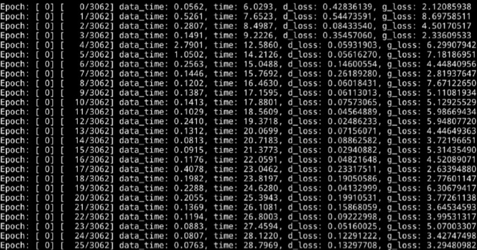

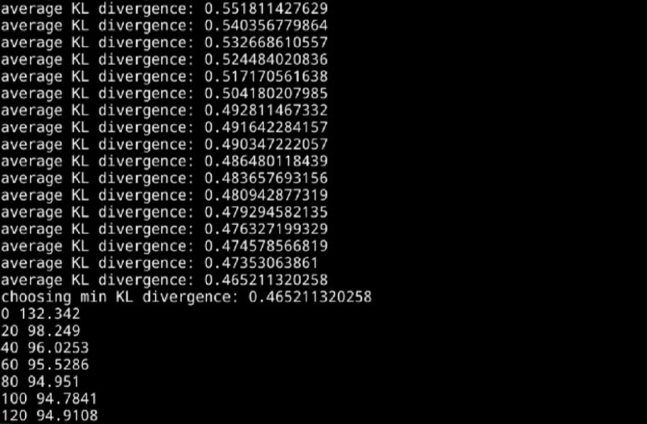

Monitor training using Tensorboard

```bash
tensorboard --logdir=logs_face --port=8888
```

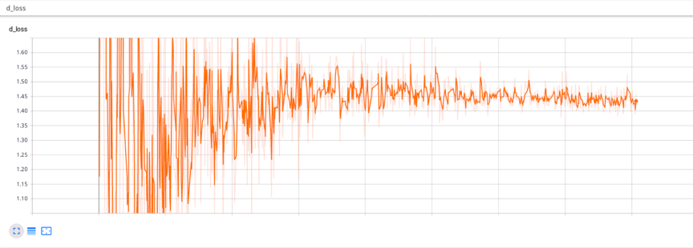

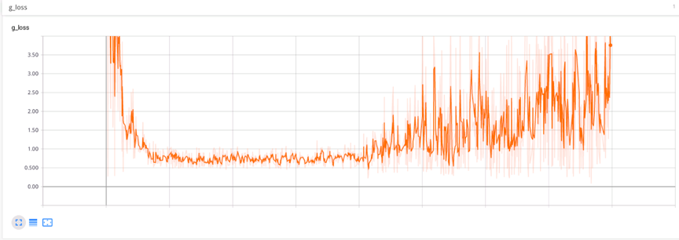

------


## Acknowledgement

Codes are based on [DCGAN](https://github.com/carpedm20/DCGAN-tensorflow) and [dcgan-completion](https://github.com/bamos/dcgan-completion.tensorflow).

------


## Citation

Consider citing the following paper if you find this repo helpful:

```
@misc{lu2017image,
    title={Image Generation from Sketch Constraint Using Contextual GAN},
    author={Yongyi Lu and Shangzhe Wu and Yu-Wing Tai and Chi-Keung Tang},
    year={2017},
    eprint={1711.08972},
    archivePrefix={arXiv},
    primaryClass={cs.CV}
}
```

