# HOMEWORK 1: Exercises for Monte Carlo Methods

## Exercise 1

蒙特卡洛方法可以用于产生接近 pi 的近似值。图 1 显示了一个带有 1/4 内切圆在内的边长为 1 的正方形。正方形的面积是 1，该 1/4 圆的面积为 pi/4。通过编 程实现在这个正方形中产生均匀分布的点。落在圈内（红点）的点和总的投在 正方形（红和绿点）上的点的比率给出了 pi/4 的近似值。这一过程称为使用蒙 特卡洛方法来仿真逼近 pi 实际值。令 N 表示总的投在正方形的点。当投点个数分别是 20, 50, 100, 200, 300, 500, 1000, 5000 时，pi 值分别是多少？对于每个 N， 每次实验算出 pi 值，重复这个过程 20 次，并在表中记下均值和方差。

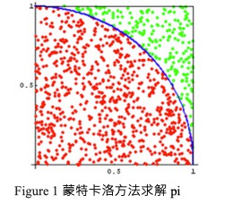

### 算法概述

蒙特卡洛方法的名字来源于摩纳哥的一个城市蒙特卡洛，该城市以赌博业闻名，而蒙特卡洛方法正是以概率为基础的方法。 蒙特卡洛方法（Monte Carlo method），也称统计模拟方法，是二十世纪四十年代中期由于科学技术的发展和电子计算机的发明，而被提出的一种以概率统计理论为指导的一类非常重要的数值计算方法。是指使用随机数（或更常见的伪随机数）来解决很多计算问题的方法。

在单位正方形中，产生随机坐标点，计算与原点的距离小于等于1的点的个数，记作 n，与所有点的个数 N 的比值即可作为 pi/4 的近似值。根据概率论，当 N 越大时，近似值的误差越小。

```matlab
clear;
points_num = [20, 50, 100, 200, 300, 500, 1000, 5000];
cal_pi_mean = [];
cal_pi_var = [];

for num = points_num
    cal_pi = [];
    for x = 1:20
        in_count = 0;
        for y = 1:num
            x_cor = rand(1);
            y_cor = rand(1);
            if x_cor*x_cor + y_cor*y_cor <= 1
                in_count = in_count + 1;
            end
        end
        cal_pi = [cal_pi in_count * 4 / num];
    end
    cal_pi_mean = [cal_pi_mean mean(cal_pi)];
    cal_pi_var = [cal_pi_var var(cal_pi)];
end

subplot(2,1,1);
plot(points_num,cal_pi_mean);
title('Adopt the Monte Carlo method to estimate the value of pi');
xlabel('the number of points in the unit square');
ylabel('the mean of estimated value of pi');
subplot(2,1,2);
plot(points_num,cal_pi_var);
xlabel('the number of points in the unit square');
ylabel('the variance of estimated value of pi');
```


### 实验结果

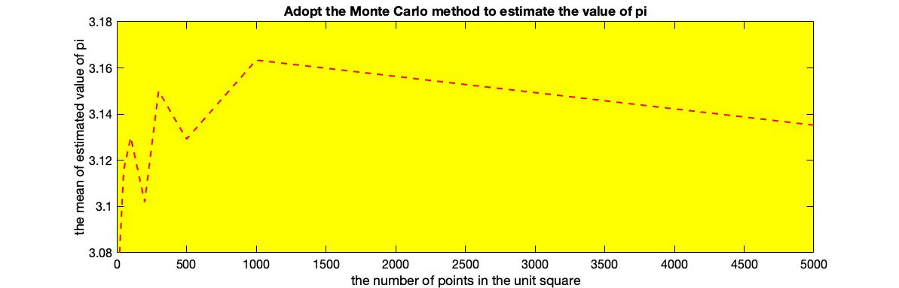

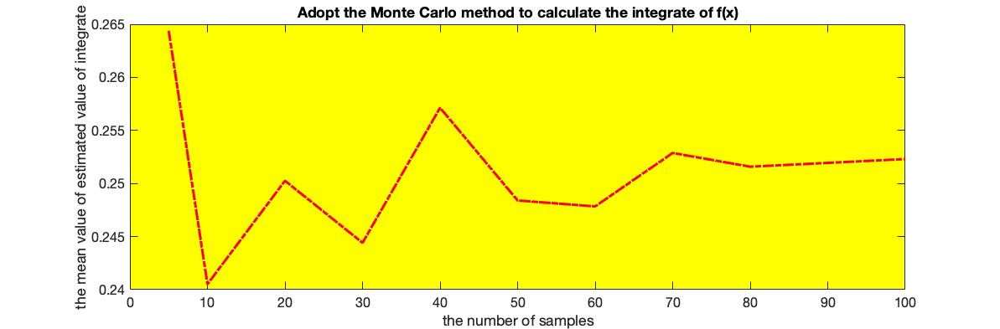

| 投点个数 | 20 次测试 pi 的均值 | 20 次测试的方差      |
| -------- | ------------------- | -------------------- |
| 20       | 3.08000000000000    | 0.132210526315790    |
| 50       | 3.11600000000000    | 0.0676884210526316   |
| 100      | 3.13000000000000    | 0.0348421052631579   |
| 200      | 3.10200000000000    | 0.0179326315789474   |
| 300      | 3.15000000000000    | 0.0106456140350877   |
| 500      | 3.12920000000000    | 0.00593027368421052  |
| 1000     | 3.16340000000000    | 0.00176383157894737  |
| 5000     | 3.13524000000000    | 0.000549758315789475 |

1. 随着投点的次数增加，方差在减少，圆周率 $\pi$ 计算的准确率在增加
2. 但当次数达到一定规模时，准确率精度增加在减缓，其原因是生成的随机数是伪随机的，这也是蒙特卡洛算法达不到祖冲之求圆周率精度的内在原因


## Exercise 2

我们现在尝试通过蒙特卡洛的方法求解如下的积分：

$$
\int_0^1 {x^3} \,{\rm d}x
$$
该积分的求解我们可以直接求解， 即有$\int_{x=0}^1 {x^3} \,{\rm d}x = \frac{1}{4}$。如果你用蒙特卡洛的方法求解该积分，你认为 x 可以通过什么分布采样获得？如果采样次数是分别是 N = 5, 10, 20, 30, 40, 50, 60, 70, 80, 100，积分结果有多好？对于每个采样次数 N，重复蒙特卡洛过程 100 次，求出均值和方差，然后在表格中记录对应的均值和方差。


### 算法描述


[参考](http://www.scratchapixel.com/lessons/mathematics-physics-for-computer-graphics/monte-carlo-methods-in-practice/monte-carlo-integration)

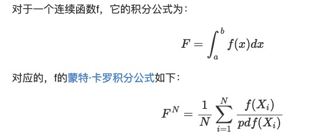


**所以对于连续函数f，f的每个可能取值x的出现概率等于x的取值范围[a,b]的倒数，即均匀分布**

**可以使用 matlab 中的 rand 产生随机分布的采样点**


```matlab
clear;
sample_num = [5, 10, 20, 30, 40, 50, 60, 70, 80, 100];

cal_integrate_mean = [];
cal_integrate_var = [];

for num = sample_num
    cal_integrate = [];
    for x = 1:100
        cal_sum = 0;
        for y = 1:num
            x_cor = rand(1);
            cal_sum = cal_sum + power(x_cor,3);
        end
        cal_integrate = [cal_integrate cal_sum / num];
    end
    cal_integrate_mean = [cal_integrate_mean mean(cal_integrate)];
    cal_integrate_var = [cal_integrate_var var(cal_integrate)];
end

subplot(2,1,1);
plot(sample_num,cal_integrate_mean);
title('Adopt the Monte Carlo method to calculate the integrate of f(x)');
xlabel('the number of samples');
ylabel('the mean value of estimated value of integrate');
subplot(2,1,2);
plot(sample_num,cal_integrate_var);
xlabel('the number of samples');
ylabel('the variance of estimated value of integrate');
```


### 实验结果

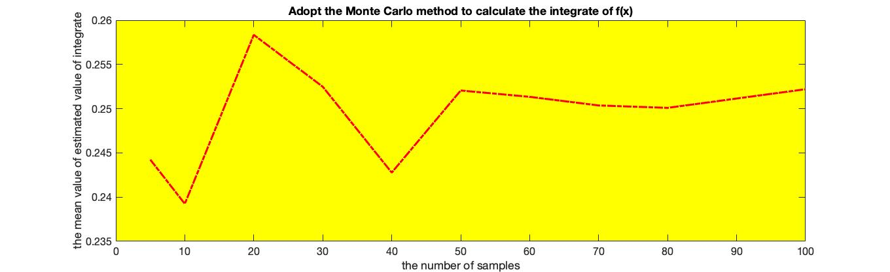

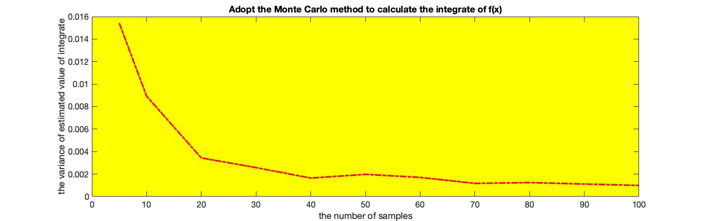

| 采样次数 | 100次测试的均值   | 100次测试的方差      |
| -------- | ----------------- | -------------------- |
| 5        | 0.244234442843949 | 0.0154290530849741   |
| 10       | 0.239243678731331 | 0.00892726102142538  |
| 20       | 0.258343794651879 | 0.00343968199866542  |
| 30       | 0.252479391401457 | 0.00257872525916870  |
| 40       | 0.242771408252728 | 0.00164868773369621  |
| 50       | 0.252054098370322 | 0.00197827066319704  |
| 60       | 0.251338271860725 | 0.00170797214775276  |
| 70       | 0.250363662253486 | 0.00117675272075054  |
| 80       | 0.250091736260338 | 0.00124772108843291  |
| 100      | 0.252201478522939 | 0.000992651575872455 |

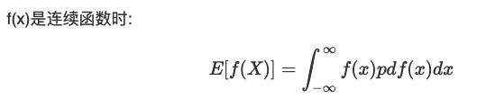

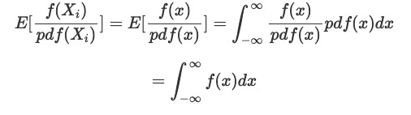


1. 随着采样次数增加，方差在减少，并逐渐接近真实值 1/4。


## Exercise 3

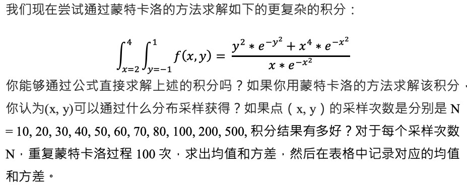


### 算法描述

对 Ex2 中进行二重积分的推导，利用 matlab 中 rand 随机产生均匀分布的 x 和 y 值

```matlab
 x_cor = rand(1) * 2 + 2;
 y_cor = rand(1) * 2 - 1;
```

注意 pdf 发生变化，为 $\frac{1}{(4-2)*(1-(-1)}​$

```matlab
clear;
sample_num = [10, 20, 30, 40, 50, 60, 70, 80, 100, 200, 500];

cal_integrate_mean = [];
cal_integrate_var = [];

for num = sample_num
    cal_integrate = [];
    for x = 1:100
        cal_sum = 0;
        for y = 1:num
            x_cor = rand(1) * 2 + 2;
            y_cor = rand(1) * 2 - 1;
            cal_sum = cal_sum + 4 *(power(y_cor,2) * exp(-power(y_cor,2)) + power(x_cor,4) * exp(-power(x_cor,2))) / (x_cor * exp(-power(x_cor,2)));
        end
        cal_integrate = [cal_integrate cal_sum / num];
    end
    cal_integrate_mean = [cal_integrate_mean mean(cal_integrate)];
    cal_integrate_var = [cal_integrate_var var(cal_integrate)];
end

subplot(2,1,1);
plot(sample_num,cal_integrate_mean);
title('Adopt the Monte Carlo method to calculate the integrate of f(x)');
xlabel('the number of samples');
ylabel('the mean value of estimated value of integrate');
subplot(2,1,2);
plot(sample_num,cal_integrate_var);
xlabel('the number of samples');
ylabel('the variance of estimated value of integrate');
```


### 实验结果

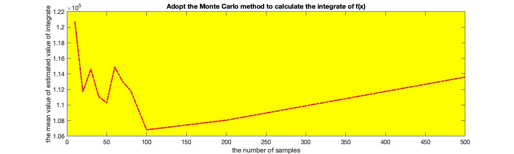

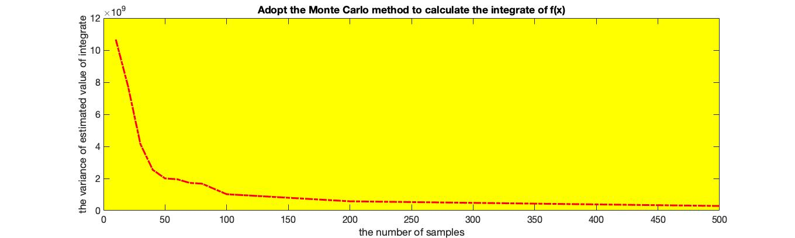

| 采样次数 | 100次测试的均值  | 100次测试的方差  |
| -------- | ---------------- | ---------------- |
| 10       | 120730.533081229 | 10664179995.0494 |
| 20       | 111697.886086776 | 7734098696.89073 |
| 30       | 114617.371155045 | 4143089883.10746 |
| 40       | 111088.819658631 | 2540573683.00076 |
| 50       | 110290.009120780 | 2005603506.71850 |
| 60       | 114904.894810841 | 1949580397.16369 |
| 70       | 113007.219401813 | 1725246918.10752 |
| 80       | 111878.052497373 | 1677042560.01881 |
| 100      | 106829.332907505 | 1020086295.36318 |
| 200      | 108061.021477633 | 578874013.891964 |
| 500      | 113602.480835554 | 287945639.303187 |


### 