[TOC]

# Homework 2: Multivariate Linear Regression

## Exercise 1

> 你需要用多少个参数来训练该线性回归模型？请使用梯度下降方法训练。训练时，请把迭代次数设成 1500000，学习率设成 0.00015，参数都设成 0.0。在训练的过程中，每迭代 100000 步，计算训 练样本对应的误差，和使用当前的参数得到的测试样本对应的误差。请画图显示迭代到达 100000 步、 200000 步、… … 1500000 时对应的训练样本的误差和测试样本对应的误差（图可以手画，或者用工具画图）。从画出的图中，你发现什么？请简单分析。
>


### 算法概述

#### 多元线性回归模型

在此多元线性回归模型中，自变量为一个向量，为训练样本的前两列数据，因变量为一个标量，为训练样本的第三列数据

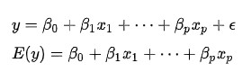

根据如上公式发现**需要三个未知参数**，其中 $[\beta_1, \beta_2]'$ 为斜率，$\beta_0$ 为偏差项，即截距

由于观测值，即训练数据有若干个，因此把这些观测值按行叠加起来就成为了一个向量或者矩阵表示为

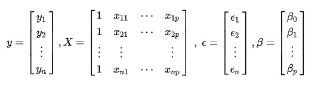

这时多元线性回归的表示就变成了

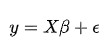

其中，噪声误差 $\epsilon ～N（0，\sigma^2）$


#### 损失函数

引入最大似然估计 MLE ，**似然函数**与概率非常类似但又有根本的区别，概率为在某种条件（参数）下预测某事件发生的可能性；而似然函数与之相反，为已知该事件的情况下**推测出该事件发生时的条件（参数）**；所以似然估计也称为参数估计，为参数估计中的一种算法

对于单个训练数据，线性回归模型也可以表示为：

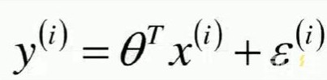

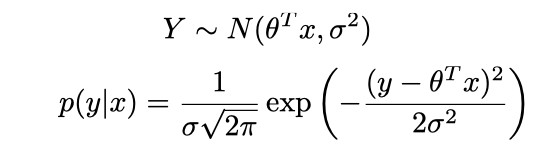

假设数据集是独立同分布的，则联合概率密度函数为

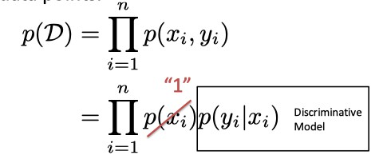

将 p（x，y）带入上式得

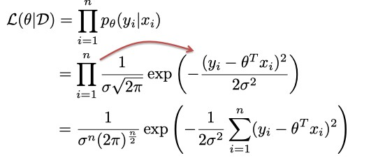

因为log函数为单调递增的，不影响极值处理，取对数得

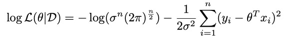

移除不带 $\theta$ 的常数项后

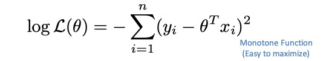

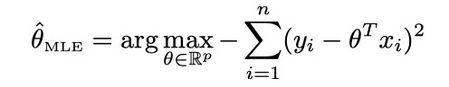

最后得到损失函数为真实值和估计值的误差平方和

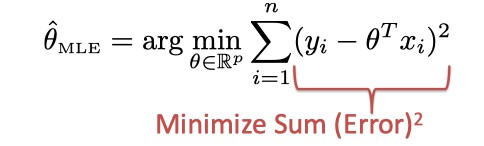

**当损失函数最小时，我们就能得到该数据集最吻合的正态分布对应的概率分布函数的总似然最大的情况，也就是我们想要的最优解。**


#### 梯度下降

对凸二次函数使用链式法则进行梯度计算

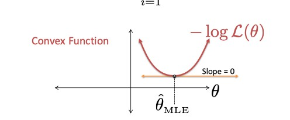

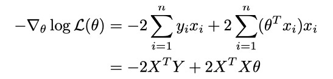

**梯度决定了损失函数向着局部极小值下降的最快方向，学习率则为步长，如下所示**

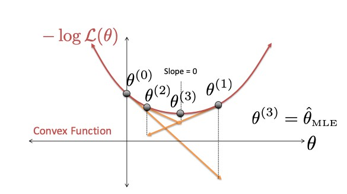

每次迭代，更新 $\theta$

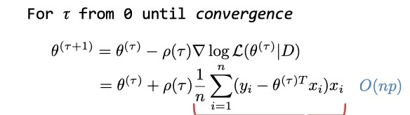

**为了计算的方便，注意上面的梯度是当损失函数为**
$$
\frac{1}{2n}\sum^n_{i=1}{(y_i - \theta^Tx_i)^2} ，公式（1.2）
$$
**求导得到的**


#### 数据归一化

由于以下原因

- 数值计算是通过计算来迭代逼近的，如果自变量量数量级相差太大，则很容易在运算过程中丢失，出现 nan 的结果
- 不同数量级的自变量对权重影响的不同

需要通过预处理，让初始的特征量具有同等的地位，这个预处理的过程为**数据归一化（Normalization）**

归一化一般使用的是**特征缩放（feature scaling）**的方法进行归一化，即

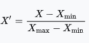

#### 数据标准化

由于在机器学习中，归一化的应用场景是有限，因为当样本中有异常点时，归一化有可能将正常的样本“挤”到一起去。标准化是更常用的手段，可以将训练集中某一列**数值**特征（假设是第i列）的值缩放成均值为0，方差为1的标准正态分布状态。

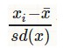


### 具体代码

使用 python 的 tensorflow 框架进行训练

```python
import tensorflow as tf
import numpy as np
import matplotlib.pyplot as plt
from sklearn import preprocessing   

# Try to find value for W and b to compute y_data = x_data * W + b  

# Define dimensions
d = 2    # Size of the parameter space
N = 50 # Number of data sample

# Model parameters
W = tf.Variable(tf.zeros([d, 1], tf.float32), name="weights")
b = tf.Variable(tf.zeros([1], tf.float32), name="biases")

# Model input and output
x = tf.placeholder(tf.float32, shape=[None, d])
y = tf.placeholder(tf.float32, shape=[None, 1])

# hypothesis
linear_regression_model = tf.add(tf.matmul(x, W), b)
# cost/loss function
loss = tf.reduce_mean(tf.square(linear_regression_model - y)) / 2

# optimizer
optimizer = tf.train.GradientDescentOptimizer(learning_rate=0.00015)
train = optimizer.minimize(loss)

# 导入训练集和测试集
training_filename = "dataForTraining.txt"
testing_filename = "dataForTesting.txt"
training_dataset = np.loadtxt(training_filename)
testing_dataset = np.loadtxt(testing_filename)
dataset = np.vstack((training_dataset,testing_dataset))

# 保存训练集中的参数（均值、方差）直接使用其对象转换测试集数据
# 特征缩放
min_max_scaler = preprocessing.MinMaxScaler() 
# 标准化
normal_scaler = preprocessing.StandardScaler().fit(training_dataset)
# 归一化
dataset = min_max_scaler.fit_transform(dataset)
# 标准化
training_dataset = normal_scaler.transform(training_dataset)
testing_dataset = normal_scaler.transform(testing_dataset)

x_train = np.array(training_dataset[:,:2])
y_train = np.array(training_dataset[:,2:3])
x_test = np.array(testing_dataset[:,:2])
y_test = np.array(testing_dataset[:,2:3])

save_step_loss = {"step":[],"train_loss":[],"test_loss":[]}# 保存step和loss用于可视化操作
init = tf.global_variables_initializer()
with tf.Session() as sess:
    sess.run(init)  # reset values to wrong
    steps = 150001
    for i in range(steps):
        sess.run(train, {x: x_train, y: y_train})
        if i % 10000 == 0:
            # evaluate training loss
            print("iteration times: %s" % i)
            curr_W, curr_b, curr_train_loss = sess.run([W, b, loss], {x: x_train, y: y_train})
            print("W: %s \nb: %s \nTrain Loss: %s" % (curr_W, curr_b, curr_train_loss))
            # evaluate testing loss
            curr_test_loss = sess.run(loss,{x:x_test,y:y_test})
            print("Test Loss: %s\n" % curr_test_loss)
            save_step_loss["step"].append(i)
            save_step_loss["train_loss"].append(curr_train_loss)
            save_step_loss["test_loss"].append(curr_test_loss)

#画图损失函数变化曲线
...
```


### 结果分析

当学习率为 0.00015 ，初始参数都为 0 ，损失函数为

$$
\frac{1}{2n}\sum^n_{i=1}{(y_i - \theta^Tx_i)^2} ，公式（1.2）
$$

```python
# cost/loss function
loss = tf.reduce_mean(tf.square(linear_regression_model - y)) / 2
```

每 10 万步训练的结果为


| 迭代次数 | 训练误差      | 测试误差       |
| -------- | ------------- | -------------- |
| 10万     | 0.010694978   | 0.0068427073   |
| 20万     | 0.004365819   | 0.0024256264   |
| 30万     | 0.0018175665  | 0.0008579258   |
| 40万     | 0.0007625969  | 0.0002942976   |
| 50万     | 0.00032301687 | 0.000104038816 |
| 60万     | 0.00013708518 | 5.0109502e-05  |
| 70万     | 6.0287868e-05 | 4.431181e-05   |
| 80万     | 2.7964898e-05 | 5.1905798e-05  |
| 90万     | 1.2988224e-05 | 6.3162064e-05  |
| 100万    | 7.280114e-06  | 7.358234e-05   |
| 110万    | 5.8223914e-06 | 7.497685e-05  |
| ...      | ...           | ...            |

**见图 1.1**	

- 发现收敛速度较慢，在收敛后测试误差大于训练误差，可以适当增加学习率减少到达收敛时迭代的次数
- 测试误差在 70 万次迭代左右会达到最小，并在之后反弹，而训练误差一直可能是由于过拟合的问题


保持损失函数为 1.2 式不变，**对原始数据进行标准化**，由于在 10 万次以内收敛，将迭代次数改为 15 万次，每 1 万次显示训练结果，**见图 1.2**

- 发现收敛速度变快，在 10 万次左右收敛。具体原因见总结。

​		

当**直接利用原始数据进行训练的结果**为

| 迭代次数 | 训练误差  | 测试误差  |
| -------- | --------- | --------- |
| 10万     | 33.503178 | 62.241535 |
| 20万     | 7.535531  | 59.77898  |
| 30万     | 2.9105134 | 63.006298 |
| 40万     | 2.089079  | 65.11604  |
| 50万     | 1.9431273 | 66.11772  |
| 60万     | 1.9135444 | 66.6166|
| ...      | ...       | ...       |

**见图1.3**

- 发现收敛速度介于对数据进行标准化和归一化之间，且同样出现了过拟合的问题，说明归一化对此训练集的处理效果不如标准化。


## Exercise 2

> 现在，你改变学习率，比如把学习率改成 0.0002（此时，你可以保持相同的迭代次数也可以改变迭代次数），然后训练该回归模型。你有什么发现？请简单分析。
>

### 结果分析

改变学习率，其余不变

```python
optimizer = tf.train.GradientDescentOptimizer(learning_rate=0.0002)
```

**未进行归一化或者标准化**时，不同于第一问，由于学习率的增加，导致迭代到10万次时就产生 nan 的结果，说明对于**没有预处理的数据，此学习率过大，得到的误差梯度在更新中累积得到一个非常大的梯度，这样的梯度会大幅度更新未知参数，进而导致迭代不稳定。在极端情况下，权重的值变得特别大，以至于结果会溢出（NaN值），即梯度爆炸**


进行**特征缩放归一化后**的结果

| 迭代次数 | 训练误差      | 测试误差      |
| -------- | :------------ | ------------- |
| 10万     | 0.007903346   | 0.004828136   |
| 20万     | 0.0024309573  | 0.0012166699  |
| 30万     | 0.0007622265  | 0.00029435699 |
| 40万     | 0.00024147338 | 7.637401e-05  |
| 50万     | 7.796503e-05  | 4.368423e-05  |
| 60万     | 2.6596446e-05 | 5.2485626e-05 |
| 70万     | 1.1197945e-05 | 6.337282e-05  |
| 80万     | 5.463813e-06  | 7.764882e-05  |
| 90万     | 4.4367066e-06 | 7.910379e-05  |
| ...      | ...           | ... |

**见图 2.1**

- 相比较于第一问（**图1.1**）在110万迭代次数误差收敛，对于相同数量级的训练和测试误差，在迭代次数到达80万时就会收敛。
- 说明**在一定范围内学习率越大，收敛速度越快**，但过大也会导致错过极小值点，造成误差的波动，具体原因见总结。


进行**标准化后**的结果，同第一问一样，改变迭代次数为 15 万次，每 1 万次显示结果，**见图2.2**

- 相比较于第一问（**图1.2**）会在 8 万次左右收敛，收敛速度较之前快，印证了如上结论。


## Exercise 3

现在，我们使用其他方法来获得最优的参数。你是否可以用随机梯度下降法获得最优的参数？ 请使用随机梯度下降法画出迭代次数（每 K 次，这里的 K 你自己设定）与训练样本和测试样本对应的误差的图。比较 Exercise 1 中的实验图，请总结你的发现。


### 结果分析

随机梯度下降**减少了每次计算梯度的复杂度**，一种方法是每次迭代随机选择一个训练样本的误差进行梯度计算（课件中）

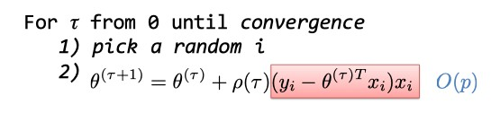

```python
random_index = np.random.choice(N)
sess.run(train, {x: [x_train[random_index]], y:[y_train[random_index]]})
```

另外一种是类似于 mini-batch 的方法，将 mini-batch 的 size 设置为 1，循环选择训练样本进行梯度计算并更新权重

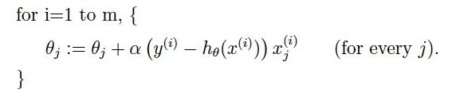

```python
mini_batch_size = 1
n_batch = N // mini_batch_size + (N % mini_batch_size != 0)
...
loop
				i_batch = (i % n_batch)*mini_batch_size
        batch = x_train[i_batch:i_batch+mini_batch_size], y_train[i_batch:i_batch+mini_batch_size]
        sess.run(train, {x: batch[0], y:batch[1]})
end loop
```


同样每 10 万次显示训练误差和测试误差，忽略归一化和标准化的步骤，**直接利用原始数据并进行 random 选择（第一种方法）样本进行训练的结果**为

| 迭代次数 | 训练误差    | 测试误差      |
| -------- | :---------- | ------------- |
| 10万     | 161.6851    | 144.4163     |
| 20万     | 127.918045  | 98.57767     |
| 30万     | 108.15653   | 91.89929     |
| 40万     | 92.329544   | 94.36559     |
| 50万     | 78.49047    | 66.74569     |
| 60万     | 66.81178    | 61.61593     |
| 70万     | 60.5053     | 98.280365    |
| 80万     | 46.82453    | 63.856804    |
| 90万     | 43.613724   | 44.74122     |
| 100万    | 36.005184   | 82.44847     |
| 110万    | 30.851025   | 44.956745    |
| 120万    | 25.451572   | 73.33224     |
| 130万    | 24.91912    | 87.98949     |
| 140万    | 17.78771    | 60.099987    |
| 150万    | 15.59241    | 67.05955     |

**见图3.1**

- 发现训练误差一直在减少，但未收敛；测试误差首先会下降然后一直波动（**原因在于每次更新 $\theta$ 的幅度比之前大，根据梯度计算的公式可知整体样本算梯度时会存在抵消的情况**），与第一问**图 1.3** 比较发现，训练误差减少的较慢，训练结果较差，在 150 万次后无法得到最优的参数
- 说明 random 方法的训练效果并不好，因为**每次选择训练的样本随机，不能保证向着全局最优的方向下降**，并且更新参数较慢。


**直接利用原始数据并进行循环选择（第二种方法）样本进行训练的结果，见图 3.2**

- 效果好于上一种方法，并且训练误差和测试误差都会收敛到全局最优值附近，说明这种循环选择的方式能更好地训练模型
- 与第一问**图1.3** 进行比较发现，最终的测试误差低于前者，也没有出现反弹的过拟合情况。


**标准化后进行 random 方法训练的结果，见图3.3**

- 明显比原始数据的训练效果好，会很快收敛到较小值，但由于 random 不能保证每次向着全局最优的方向下降，所有会一直波动。


**标准化后进行循环方法训练的结果，见图3.4**

- 比 random 方法改善的地方在于，收敛后不会发生明显的波动


## 总结

### 标准化和归一化

1. 归一化是将训练集中某一列**数值**特征（假设是第i列）的值缩放到0和1之间
2. 标准化是将训练集中某一列**数值**特征（假设是第i列）的值缩放成均值为0，方差为1的状态
3. 归一化和标准化的相同点都是对**某个特征（column）**进行缩放（scaling）而不是对某个样本的特征向量（row）进行缩放
4. 归一化是让不同维度之间的特征在数值上有一定比较性，可以大大提高模型精度。
5. **对于线性model来说**，数据归一化后，最优解的寻优过程明显会变得平缓，更容易正确的收敛到最优解。

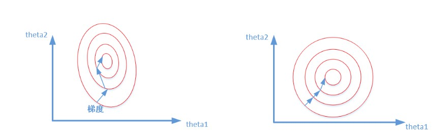

前者是没有经过归一化的，在梯度下降的过程中，走的路径更加的曲折，而第二个图明显路径更加平缓，收	敛速度更快。标准化前，由于变量的单位相差很大，导致了椭圆型的梯度轮廓。标准化后，把变量变成统一单位，产生了圆形轮廓。由于梯度下降是按切线方向下降，所以导致了系统在椭圆轮廓不停迂回地寻找最优解，而圆形轮廓就能轻松找到了。一种比较极端的情况，有时没做标准化，模型始终找不到最优解，一直不收敛。


### 学习率

**学习率为超参数**，如果选择的学习速率过小，收敛速度慢，会花费太长的训练时间：

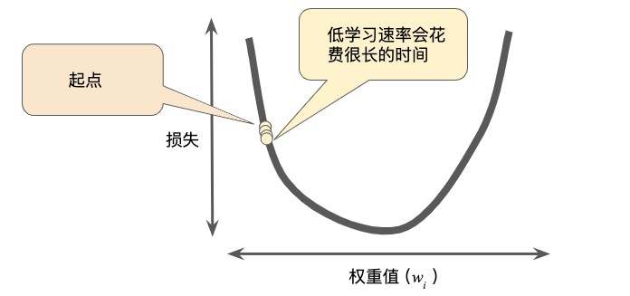

如果学习率过大，会在极小值点附近波动，无法收敛

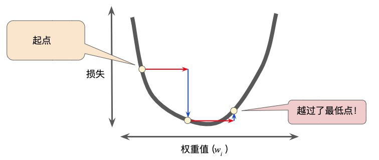

训练应当从相对较大的学习率开始。这是因为在开始时，初始的随机权重远离最优值。在训练过程中，学习率应当下降，以允许细粒度的权重更新。


### SGD

SGD 的优点在于当数据集部分数据冗余时，避免每次参数更新时对相似的样例进行梯度重复计算，而是**用样本中的一个例子来近似所有的样本**，因此，SGD速度会更快（**迭代步数可能不会减少，但每次迭代的计算时间减少**）。

然而 SGD 的缺点在于，随机剃度下降是不会收敛到最优点的，它总是在最优点附近跳来跳去，并不是每次迭代都向着整体最优化方向（**因为梯度的计算是用一个随机样本进行的近似**），但是大的整体的方向是向全局最优解的，最终的结果往往是在全局最优解附近。即使我们到达了最优点，它依然会跳动，因为对于随机的样本来说，这些少数的样本在最优点的梯度也未必是0（整体的梯度是0）。


## 图例


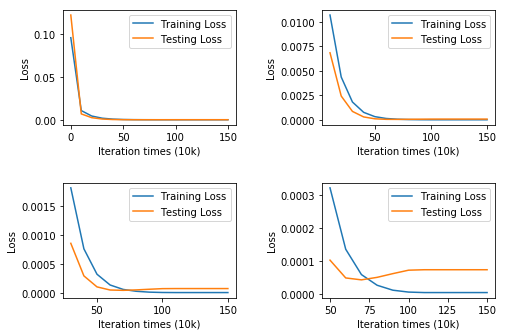1.1


1.2


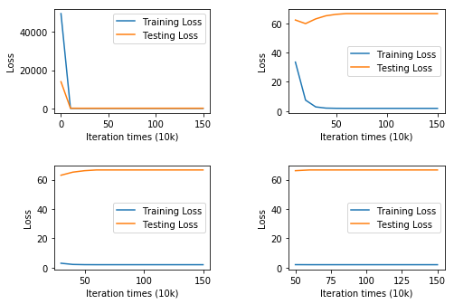1.3


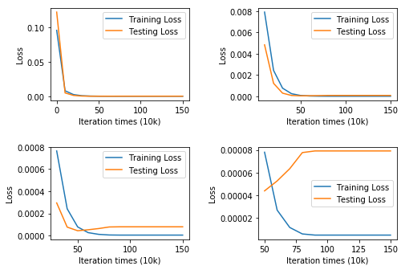2.1


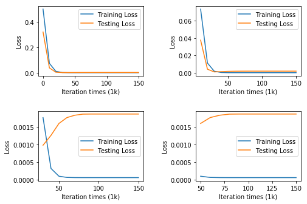2.2


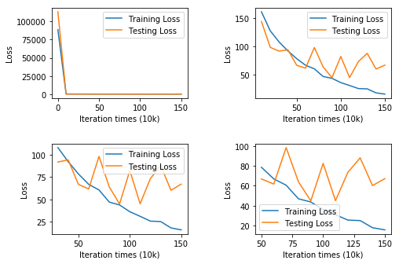3.1


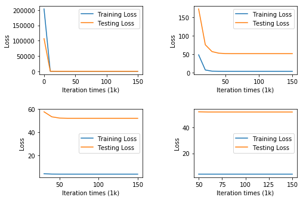3.2


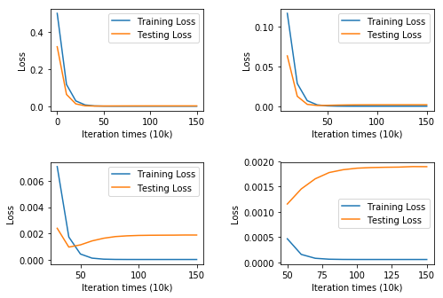3.3


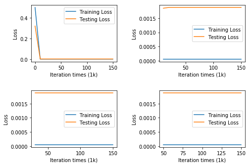3.4


