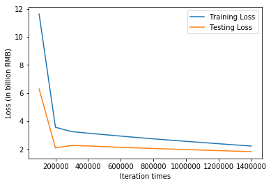

```python
import tensorflow as tf
import numpy as np
import matplotlib.pyplot as plt

# Try to find value for W and b to compute y_data = x_data * W + b  

# Model parameters
W = tf.Variable(tf.zeros([2, 1], tf.float32), name="weights")
b = tf.Variable(tf.zeros([1], tf.float32), name="biases")

# Model input and output
x = tf.placeholder(tf.float32, shape=[None, 2])
y = tf.placeholder(tf.float32, shape=[None, 1])

# hypothesis
linear_regression_model = tf.add(tf.matmul(x, W), b)
# cost/loss function
loss = tf.reduce_mean(tf.square(linear_regression_model - y)) / 100

# optimizer
optimizer = tf.train.GradientDescentOptimizer(learning_rate=0.00015)
train = optimizer.minimize(loss)

training_filename = "dataForTraining.txt"
testing_filename = "dataForTesting.txt"
training_dataset = np.loadtxt("dataForTraining.txt")
testing_dataset = np.loadtxt("dataForTesting.txt")
x_train = np.array(training_dataset[:,:2])
y_train = np.array(training_dataset[:,2:3])
x_test = np.array(testing_dataset[:,:2])
y_test = np.array(testing_dataset[:,2:3])
print(x_train.shape)
print(y_train.shape)

save_step_loss = {"step":[],"train_loss":[],"test_loss":[]}# 保存step和loss用于可视化操作

init = tf.global_variables_initializer()
with tf.Session() as sess:
    sess.run(init)  # reset values to wrong
    steps = 1500000
    for i in range(steps):
        sess.run(train, {x: x_train, y: y_train})
        if i % 100000 == 0:
            # evaluate training accuracy
            print("iteration times: %s" % i)
            curr_W, curr_b, curr_train_loss = sess.run([W, b, loss], {x: x_train, y: y_train})
            print("W: %s b: %s loss: %s" % (curr_W, curr_b, curr_train_loss))
            # Accuracy computation
            curr_test_loss = sess.run(loss,{x:x_test,y:y_test})
            print("Test loss: %s\n" % curr_test_loss)
            save_step_loss["step"].append(i)
            save_step_loss["train_loss"].append(curr_train_loss)
            save_step_loss["test_loss"].append(curr_test_loss)

#画图损失函数变化曲线
plt.plot(save_step_loss["step"],save_step_loss["train_loss"],label='Training Loss')
plt.plot(save_step_loss["step"],save_step_loss["test_loss"],label='Testing Loss')
plt.xlabel('Iteration times')
plt.ylabel('Loss (in billion RMB)')
plt.legend()
plt.show()
#画图损失函数变化曲线
plt.plot(save_step_loss["step"][1:],save_step_loss["train_loss"][1:],label='Training Loss')
plt.plot(save_step_loss["step"][1:],save_step_loss["test_loss"][1:],label='Testing Loss')
plt.xlabel('Iteration times')
plt.ylabel('Loss (in billion RMB)')
plt.legend()
plt.show()
```

    (50, 2)
    (50, 1)
    iteration times: 0
    W: [[0.12614042]
     [0.00496565]] b: [0.00120336] loss: 1859.3881
    Test loss: 2358.1008
    
    iteration times: 100000
    W: [[  6.9508414]
     [-61.806156 ]] b: [2.1205597] loss: 11.622533
    Test loss: 6.2855463
    
    iteration times: 200000
    W: [[  7.422183]
     [-71.45854 ]] b: [3.5575848] loss: 3.5517373
    Test loss: 2.0824382
    
    iteration times: 300000
    W: [[  7.4850435]
     [-72.954315 ]] b: [4.87227] loss: 3.2452276
    Test loss: 2.2570422
    
    iteration times: 400000
    W: [[  7.476389]
     [-73.02038 ]] b: [6.1597304] loss: 3.1333163
    Test loss: 2.222188
    
    iteration times: 500000
    W: [[  7.464731]
     [-73.02038 ]] b: [7.412138] loss: 3.028207
    Test loss: 2.1742094
    
    iteration times: 600000
    W: [[  7.453191]
     [-73.02038 ]] b: [8.651915] loss: 2.9259655
    Test loss: 2.1280217
    
    iteration times: 700000
    W: [[  7.4416504]
     [-73.02038  ]] b: [9.891691] loss: 2.8255157
    Test loss: 2.0831244
    
    iteration times: 800000
    W: [[  7.4305 ]
     [-73.02038]] b: [11.089544] loss: 2.7301679
    Test loss: 2.0409777
    
    iteration times: 900000
    W: [[  7.4198475]
     [-73.02038  ]] b: [12.233953] loss: 2.6406393
    Test loss: 2.0018494
    
    iteration times: 1000000
    W: [[  7.4091945]
     [-73.02038  ]] b: [13.378363] loss: 2.5526373
    Test loss: 1.9638199
    
    iteration times: 1100000
    W: [[  7.398542]
     [-73.02038 ]] b: [14.522772] loss: 2.4661648
    Test loss: 1.9268973
    
    iteration times: 1200000
    W: [[  7.3878894]
     [-73.02038  ]] b: [15.667181] loss: 2.3812213
    Test loss: 1.8910831
    
    iteration times: 1300000
    W: [[  7.3772364]
     [-73.02038  ]] b: [16.81159] loss: 2.2978067
    Test loss: 1.8563676
    
    iteration times: 1400000
    W: [[  7.366584]
     [-73.02038 ]] b: [17.956] loss: 2.2159188
    Test loss: 1.8227601
    




