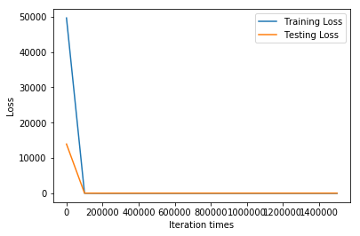
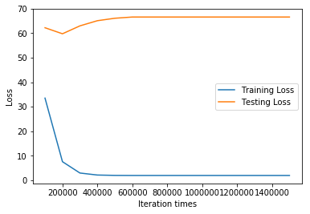
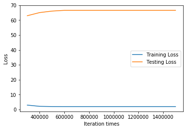
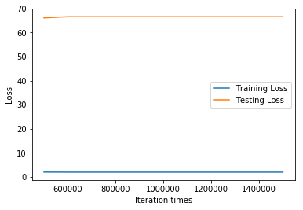

```python
import tensorflow as tf
import numpy as np
import matplotlib.pyplot as plt
from sklearn import preprocessing   

# Try to find value for W and b to compute y_data = x_data * W + b  

# Define dimensions
d = 2    # Size of the parameter space
N = 50 # Number of data sample

# Model parameters
W = tf.Variable(tf.zeros([d, 1], tf.float32), name="weights")
b = tf.Variable(tf.zeros([1], tf.float32), name="biases")

# Model input and output
x = tf.placeholder(tf.float32, shape=[None, d])
y = tf.placeholder(tf.float32, shape=[None, 1])

# hypothesis
linear_regression_model = tf.add(tf.matmul(x, W), b)
# cost/loss function
loss = tf.reduce_mean(tf.square(linear_regression_model - y)) / 2

# optimizer
optimizer = tf.train.GradientDescentOptimizer(learning_rate=0.00015)
train = optimizer.minimize(loss)

training_filename = "dataForTraining.txt"
testing_filename = "dataForTesting.txt"
training_dataset = np.loadtxt(training_filename)
testing_dataset = np.loadtxt(testing_filename)
# x_train_origin = np.array(training_dataset[:,:2])
# y_train_origin = np.array(training_dataset[:,2:3])
# x_test_origin = np.array(testing_dataset[:,:2])
# y_test_origin = np.array(testing_dataset[:,2:3])
dataset = np.vstack((training_dataset,testing_dataset))
# y_max = np.max(dataset[:,2:3])
# y_min = np.min(dataset[:,2:3])
# y_range = y_max - y_min
# y_train_max = np.max(y_train_origin)
# y_train_min = np.min(y_train_origin)
# y_train_range = y_train_max - y_train_min
# y_test_max = np.max(y_test_origin)
# y_test_min = np.min(y_test_origin)
# y_test_range = y_test_max - y_test_min
# print(y_max,y_min,y_range)

# min_max_scaler = preprocessing.MinMaxScaler()  
# training_dataset = min_max_scaler.fit_transform(training_dataset) 
# testing_dataset = min_max_scaler.fit_transform(testing_dataset) 
# dataset = min_max_scaler.fit_transform(dataset)

x_train = np.array(training_dataset[:,:2])
y_train = np.array(training_dataset[:,2:3])
x_test = np.array(testing_dataset[:,:2])
y_test = np.array(testing_dataset[:,2:3])
print("Training data shape:")
print(x_train.shape)
print("Testing data shape:")
print(x_test.shape)
print('')
print("normalized training data:")
print(x_train)
print('')
print("normalized testing data:")
print(x_test)
print('')

# train_error
# train_error = tf.reduce_mean(tf.square((linear_regression_model - y) / y)) 

save_step_loss = {"step":[],"train_loss":[],"test_loss":[]}# 保存step和loss用于可视化操作
init = tf.global_variables_initializer()
with tf.Session() as sess:
    sess.run(init)  # reset values to wrong
    steps = 1500001
    for i in range(steps):
        sess.run(train, {x: x_train, y: y_train})
        if i % 100000 == 0:
            # evaluate training accuracy
            print("iteration times: %s" % i)
            curr_W, curr_b, curr_train_loss = sess.run([W, b, loss], {x: x_train, y: y_train})
            print("W: %s \nb: %s \nTrain Loss: %s" % (curr_W, curr_b, curr_train_loss))
            # evaluate testing accuracy
            curr_test_loss = sess.run(loss,{x:x_test,y:y_test})
            print("Test Loss: %s\n" % curr_test_loss)
            save_step_loss["step"].append(i)
            save_step_loss["train_loss"].append(curr_train_loss)
            save_step_loss["test_loss"].append(curr_test_loss)
#             print("Train Error: %s" % sess.run(train_error,{x:x_train,y:y_train}))
#             print("Test Error: %s\n" % sess.run(train_error,{x:x_test,y:y_test}))

#画图损失函数变化曲线
plt.plot(save_step_loss["step"],save_step_loss["train_loss"],label='Training Loss')
plt.plot(save_step_loss["step"],save_step_loss["test_loss"],label='Testing Loss')
plt.xlabel('Iteration times')
plt.ylabel('Loss')
plt.legend()
plt.show()
#画图损失函数变化曲线
plt.plot(save_step_loss["step"][1:],save_step_loss["train_loss"][1:],label='Training Loss')
plt.plot(save_step_loss["step"][1:],save_step_loss["test_loss"][1:],label='Testing Loss')
plt.xlabel('Iteration times')
plt.ylabel('Loss')
plt.legend()
plt.show()
#画图损失函数变化曲线
plt.plot(save_step_loss["step"][3:],save_step_loss["train_loss"][3:],label='Training Loss')
plt.plot(save_step_loss["step"][3:],save_step_loss["test_loss"][3:],label='Testing Loss')
plt.xlabel('Iteration times')
plt.ylabel('Loss')
plt.legend()
plt.show()
#画图损失函数变化曲线
plt.plot(save_step_loss["step"][5:],save_step_loss["train_loss"][5:],label='Training Loss')
plt.plot(save_step_loss["step"][5:],save_step_loss["test_loss"][5:],label='Testing Loss')
plt.xlabel('Iteration times')
plt.ylabel('Loss')
plt.legend()
plt.show()

print('Train Loss:\n',save_step_loss["train_loss"])
print('')
print('Test Loss:\n',save_step_loss["test_loss"])
```

    WARNING:tensorflow:From /anaconda3/lib/python3.6/site-packages/tensorflow/python/framework/op_def_library.py:263: colocate_with (from tensorflow.python.framework.ops) is deprecated and will be removed in a future version.
    Instructions for updating:
    Colocations handled automatically by placer.
    Training data shape:
    (50, 2)
    Testing data shape:
    (10, 2)
    
    normalized training data:
    [[101.     1.7 ]
     [120.     2.3 ]
     [115.     4.  ]
     [123.     2.8 ]
     [ 98.     1.2 ]
     [111.     0.3 ]
     [ 85.     0.92]
     [ 76.     3.32]
     [ 78.     4.8 ]
     [ 92.     2.7 ]
     [ 84.     6.11]
     [123.     8.2 ]
     [142.    12.4 ]
     [ 97.     7.4 ]
     [ 75.     5.55]
     [ 89.     6.3 ]
     [159.     9.4 ]
     [100.     2.5 ]
     [102.     6.4 ]
     [111.     5.32]
     [134.     8.4 ]
     [ 76.     2.78]
     [ 88.     3.44]
     [ 89.     3.42]
     [ 68.     2.69]
     [ 65.     0.8 ]
     [132.     8.8 ]
     [144.    12.4 ]
     [116.     6.7 ]
     [108.     3.86]
     [ 62.     4.2 ]
     [ 99.     7.3 ]
     [118.     5.4 ]
     [ 61.     3.33]
     [150.     7.5 ]
     [132.     6.42]
     [122.     9.38]
     [ 75.     4.53]
     [ 71.     3.77]
     [ 86.     6.72]
     [ 77.     4.63]
     [ 93.     4.55]
     [ 91.     3.7 ]
     [ 68.     4.32]
     [108.     8.51]
     [112.    10.4 ]
     [121.     3.54]
     [107.     2.78]
     [143.     1.64]
     [ 61.     0.8 ]]
    
    normalized testing data:
    [[ 93.     0.78]
     [104.     3.82]
     [110.     4.27]
     [ 69.     5.2 ]
     [ 80.     1.22]
     [ 79.     0.87]
     [128.     5.54]
     [107.     4.51]
     [ 75.     3.2 ]
     [ 96.     1.55]]
    
    iteration times: 0
    W: [[6.307022  ]
     [0.24828242]] 
    b: [0.0601679] 
    Train Loss: 49610.42
    Test Loss: 13945.736
    
    iteration times: 100000
    W: [[  7.089414]
     [-72.76044 ]] 
    b: [46.329998] 
    Train Loss: 33.503178
    Test Loss: 62.241535
    
    iteration times: 200000
    W: [[  6.9002647]
     [-72.54343  ]] 
    b: [65.48001] 
    Train Loss: 7.535531
    Test Loss: 59.77898
    
    iteration times: 300000
    W: [[  6.8204446]
     [-72.45184  ]] 
    b: [73.5612] 
    Train Loss: 2.9105134
    Test Loss: 63.006298
    
    iteration times: 400000
    W: [[  6.7869325]
     [-72.41338  ]] 
    b: [76.95402] 
    Train Loss: 2.089079
    Test Loss: 65.11604
    
    iteration times: 500000
    W: [[  6.773085]
     [-72.3975  ]] 
    b: [78.355934] 
    Train Loss: 1.9431273
    Test Loss: 66.11772
    
    iteration times: 600000
    W: [[  6.766556]
     [-72.39001 ]] 
    b: [79.017] 
    Train Loss: 1.9135444
    Test Loss: 66.6166
    
    iteration times: 700000
    W: [[  6.766556]
     [-72.39001 ]] 
    b: [79.017] 
    Train Loss: 1.9135444
    Test Loss: 66.6166
    
    iteration times: 800000
    W: [[  6.766556]
     [-72.39001 ]] 
    b: [79.017] 
    Train Loss: 1.9135444
    Test Loss: 66.6166
    
    iteration times: 900000
    W: [[  6.766556]
     [-72.39001 ]] 
    b: [79.017] 
    Train Loss: 1.9135444
    Test Loss: 66.6166
    
    iteration times: 1000000
    W: [[  6.766556]
     [-72.39001 ]] 
    b: [79.017] 
    Train Loss: 1.9135444
    Test Loss: 66.6166
    
    iteration times: 1100000
    W: [[  6.766556]
     [-72.39001 ]] 
    b: [79.017] 
    Train Loss: 1.9135444
    Test Loss: 66.6166
    
    iteration times: 1200000
    W: [[  6.766556]
     [-72.39001 ]] 
    b: [79.017] 
    Train Loss: 1.9135444
    Test Loss: 66.6166
    
    iteration times: 1300000
    W: [[  6.766556]
     [-72.39001 ]] 
    b: [79.017] 
    Train Loss: 1.9135444
    Test Loss: 66.6166
    
    iteration times: 1400000
    W: [[  6.766556]
     [-72.39001 ]] 
    b: [79.017] 
    Train Loss: 1.9135444
    Test Loss: 66.6166
    
    iteration times: 1500000
    W: [[  6.766556]
     [-72.39001 ]] 
    b: [79.017] 
    Train Loss: 1.9135444
    Test Loss: 66.6166














    Train Loss:
     [49610.42, 33.503178, 7.535531, 2.9105134, 2.089079, 1.9431273, 1.9135444, 1.9135444, 1.9135444, 1.9135444, 1.9135444, 1.9135444, 1.9135444, 1.9135444, 1.9135444, 1.9135444]
    
    Test Loss:
     [13945.736, 62.241535, 59.77898, 63.006298, 65.11604, 66.11772, 66.6166, 66.6166, 66.6166, 66.6166, 66.6166, 66.6166, 66.6166, 66.6166, 66.6166, 66.6166]

