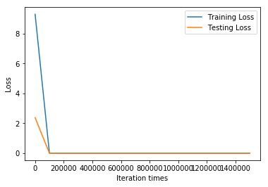

```python
import tensorflow as tf
import numpy as np
import matplotlib.pyplot as plt
from sklearn import preprocessing   

# Try to find value for W and b to compute y_data = x_data * W + b  

# Define dimensions
d = 2    # Size of the parameter space
N = 50 # Number of data sample

# Model parameters
W = tf.Variable(tf.zeros([d, 1], tf.float32), name="weights")
b = tf.Variable(tf.zeros([1], tf.float32), name="biases")

# Model input and output
x = tf.placeholder(tf.float32, shape=[None, d])
y = tf.placeholder(tf.float32, shape=[None, 1])

# hypothesis
linear_regression_model = tf.add(tf.matmul(x, W), b)
# cost/loss function
loss = tf.reduce_sum(tf.square(linear_regression_model - y))

# optimizer
optimizer = tf.train.GradientDescentOptimizer(learning_rate=0.00015)
train = optimizer.minimize(loss)

training_filename = "dataForTraining.txt"
testing_filename = "dataForTesting.txt"
training_dataset = np.loadtxt(training_filename)
testing_dataset = np.loadtxt(testing_filename)
# x_train_origin = np.array(training_dataset[:,:2])
# y_train_origin = np.array(training_dataset[:,2:3])
# x_test_origin = np.array(testing_dataset[:,:2])
# y_test_origin = np.array(testing_dataset[:,2:3])
dataset = np.vstack((training_dataset,testing_dataset))
# y_max = np.max(dataset[:,2:3])
# y_min = np.min(dataset[:,2:3])
# y_range = y_max - y_min
# y_train_max = np.max(y_train_origin)
# y_train_min = np.min(y_train_origin)
# y_train_range = y_train_max - y_train_min
# y_test_max = np.max(y_test_origin)
# y_test_min = np.min(y_test_origin)
# y_test_range = y_test_max - y_test_min
# print(y_max,y_min,y_range)

min_max_scaler = preprocessing.MinMaxScaler()  
# training_dataset = min_max_scaler.fit_transform(training_dataset) 
# testing_dataset = min_max_scaler.fit_transform(testing_dataset) 
dataset = min_max_scaler.fit_transform(dataset)

x_train = np.array(dataset[:50,:2])
y_train = np.array(dataset[:50,2:3])
x_test = np.array(dataset[50:,:2])
y_test = np.array(dataset[50:,2:3])
print("Training data shape:")
print(x_train.shape)
print("Testing data shape:")
print(x_test.shape)
print('')
print("normalized training data:")
print(x_train)
print('')
print("normalized testing data:")
print(x_test)
print('')

# train_error
# train_error = tf.reduce_mean(tf.square((linear_regression_model - y) / y)) 

save_step_loss = {"step":[],"train_loss":[],"test_loss":[]}# 保存step和loss用于可视化操作
init = tf.global_variables_initializer()
with tf.Session() as sess:
    sess.run(init)  # reset values to wrong
    steps = 1500001
    for i in range(steps):
        sess.run(train, {x: x_train, y: y_train})
        if i % 100000 == 0:
            # evaluate training accuracy
            print("iteration times: %s" % i)
            curr_W, curr_b, curr_train_loss = sess.run([W, b, loss], {x: x_train, y: y_train})
            print("W: %s \nb: %s \nTrain Loss: %s" % (curr_W, curr_b, curr_train_loss))
            # evaluate testing accuracy
            curr_test_loss = sess.run(loss,{x:x_test,y:y_test})
            print("Test Loss: %s\n" % curr_test_loss)
            save_step_loss["step"].append(i)
            save_step_loss["train_loss"].append(curr_train_loss)
            save_step_loss["test_loss"].append(curr_test_loss)
#             print("Train Error: %s" % sess.run(train_error,{x:x_train,y:y_train}))
#             print("Test Error: %s\n" % sess.run(train_error,{x:x_test,y:y_test}))

#画图损失函数变化曲线
plt.plot(save_step_loss["step"],save_step_loss["train_loss"],label='Training Loss')
plt.plot(save_step_loss["step"],save_step_loss["test_loss"],label='Testing Loss')
plt.xlabel('Iteration times')
plt.ylabel('Loss')
plt.legend()
plt.show()
#画图损失函数变化曲线
plt.plot(save_step_loss["step"][1:],save_step_loss["train_loss"][1:],label='Training Loss')
plt.plot(save_step_loss["step"][1:],save_step_loss["test_loss"][1:],label='Testing Loss')
plt.xlabel('Iteration times')
plt.ylabel('Loss')
plt.legend()
plt.show()
#画图损失函数变化曲线
plt.plot(save_step_loss["step"][3:],save_step_loss["train_loss"][3:],label='Training Loss')
plt.plot(save_step_loss["step"][3:],save_step_loss["test_loss"][3:],label='Testing Loss')
plt.xlabel('Iteration times')
plt.ylabel('Loss')
plt.legend()
plt.show()
#画图损失函数变化曲线
plt.plot(save_step_loss["step"][5:],save_step_loss["train_loss"][5:],label='Training Loss')
plt.plot(save_step_loss["step"][5:],save_step_loss["test_loss"][5:],label='Testing Loss')
plt.xlabel('Iteration times')
plt.ylabel('Loss')
plt.legend()
plt.show()

print('Train Loss:\n',save_step_loss["train_loss"])
print('')
print('Test Loss:\n',save_step_loss["test_loss"])
```

    Training data shape:
    (50, 2)
    Testing data shape:
    (10, 2)
    
    normalized training data:
    [[0.40816327 0.11570248]
     [0.60204082 0.16528926]
     [0.55102041 0.30578512]
     [0.63265306 0.20661157]
     [0.37755102 0.07438017]
     [0.51020408 0.        ]
     [0.24489796 0.05123967]
     [0.15306122 0.24958678]
     [0.17346939 0.37190083]
     [0.31632653 0.19834711]
     [0.23469388 0.48016529]
     [0.63265306 0.65289256]
     [0.82653061 1.        ]
     [0.36734694 0.58677686]
     [0.14285714 0.4338843 ]
     [0.28571429 0.49586777]
     [1.         0.75206612]
     [0.39795918 0.18181818]
     [0.41836735 0.50413223]
     [0.51020408 0.41487603]
     [0.74489796 0.66942149]
     [0.15306122 0.20495868]
     [0.2755102  0.25950413]
     [0.28571429 0.25785124]
     [0.07142857 0.19752066]
     [0.04081633 0.04132231]
     [0.7244898  0.70247934]
     [0.84693878 1.        ]
     [0.56122449 0.52892562]
     [0.47959184 0.29421488]
     [0.01020408 0.32231405]
     [0.3877551  0.5785124 ]
     [0.58163265 0.4214876 ]
     [0.         0.25041322]
     [0.90816327 0.59504132]
     [0.7244898  0.50578512]
     [0.62244898 0.75041322]
     [0.14285714 0.34958678]
     [0.10204082 0.28677686]
     [0.25510204 0.53057851]
     [0.16326531 0.35785124]
     [0.32653061 0.35123967]
     [0.30612245 0.28099174]
     [0.07142857 0.3322314 ]
     [0.47959184 0.6785124 ]
     [0.52040816 0.83471074]
     [0.6122449  0.2677686 ]
     [0.46938776 0.20495868]
     [0.83673469 0.1107438 ]
     [0.         0.04132231]]
    
    normalized testing data:
    [[0.32653061 0.03966942]
     [0.43877551 0.29090909]
     [0.5        0.32809917]
     [0.08163265 0.40495868]
     [0.19387755 0.07603306]
     [0.18367347 0.04710744]
     [0.68367347 0.43305785]
     [0.46938776 0.34793388]
     [0.14285714 0.23966942]
     [0.35714286 0.10330579]]
    
    iteration times: 0
    W: [[0.00258169]
     [0.00168237]] 
    b: [0.00565242] 
    Train Loss: 9.29617
    Test Loss: 2.3778727
    
    iteration times: 100000
    W: [[ 0.78165245]
     [-1.033069  ]] 
    b: [0.45834905] 
    Train Loss: 0.00026552752
    Test Loss: 0.0018572807
    
    iteration times: 200000
    W: [[ 0.78165245]
     [-1.033069  ]] 
    b: [0.45834905] 
    Train Loss: 0.00026552752
    Test Loss: 0.0018572807
    
    iteration times: 300000
    W: [[ 0.78165245]
     [-1.033069  ]] 
    b: [0.45834905] 
    Train Loss: 0.00026552752
    Test Loss: 0.0018572807
    
    iteration times: 400000
    W: [[ 0.78165245]
     [-1.033069  ]] 
    b: [0.45834905] 
    Train Loss: 0.00026552752
    Test Loss: 0.0018572807
    
    iteration times: 500000
    W: [[ 0.78165245]
     [-1.033069  ]] 
    b: [0.45834905] 
    Train Loss: 0.00026552752
    Test Loss: 0.0018572807
    
    iteration times: 600000
    W: [[ 0.78165245]
     [-1.033069  ]] 
    b: [0.45834905] 
    Train Loss: 0.00026552752
    Test Loss: 0.0018572807
    
    iteration times: 700000
    W: [[ 0.78165245]
     [-1.033069  ]] 
    b: [0.45834905] 
    Train Loss: 0.00026552752
    Test Loss: 0.0018572807
    
    iteration times: 800000
    W: [[ 0.78165245]
     [-1.033069  ]] 
    b: [0.45834905] 
    Train Loss: 0.00026552752
    Test Loss: 0.0018572807
    
    iteration times: 900000
    W: [[ 0.78165245]
     [-1.033069  ]] 
    b: [0.45834905] 
    Train Loss: 0.00026552752
    Test Loss: 0.0018572807
    
    iteration times: 1000000
    W: [[ 0.78165245]
     [-1.033069  ]] 
    b: [0.45834905] 
    Train Loss: 0.00026552752
    Test Loss: 0.0018572807
    
    iteration times: 1100000
    W: [[ 0.78165245]
     [-1.033069  ]] 
    b: [0.45834905] 
    Train Loss: 0.00026552752
    Test Loss: 0.0018572807
    
    iteration times: 1200000
    W: [[ 0.78165245]
     [-1.033069  ]] 
    b: [0.45834905] 
    Train Loss: 0.00026552752
    Test Loss: 0.0018572807
    
    iteration times: 1300000
    W: [[ 0.78165245]
     [-1.033069  ]] 
    b: [0.45834905] 
    Train Loss: 0.00026552752
    Test Loss: 0.0018572807
    
    iteration times: 1400000
    W: [[ 0.78165245]
     [-1.033069  ]] 
    b: [0.45834905] 
    Train Loss: 0.00026552752
    Test Loss: 0.0018572807
    
    iteration times: 1500000
    W: [[ 0.78165245]
     [-1.033069  ]] 
    b: [0.45834905] 
    Train Loss: 0.00026552752
    Test Loss: 0.0018572807
    





    Train Loss:
     [9.29617, 0.00026552752, 0.00026552752, 0.00026552752, 0.00026552752, 0.00026552752, 0.00026552752, 0.00026552752, 0.00026552752, 0.00026552752, 0.00026552752, 0.00026552752, 0.00026552752, 0.00026552752, 0.00026552752, 0.00026552752]
    
    Test Loss:
     [2.3778727, 0.0018572807, 0.0018572807, 0.0018572807, 0.0018572807, 0.0018572807, 0.0018572807, 0.0018572807, 0.0018572807, 0.0018572807, 0.0018572807, 0.0018572807, 0.0018572807, 0.0018572807, 0.0018572807, 0.0018572807]

