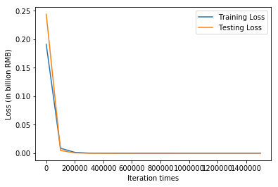
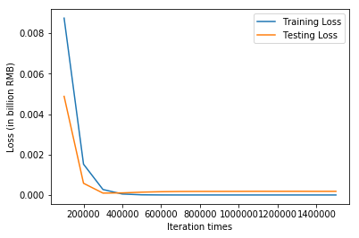
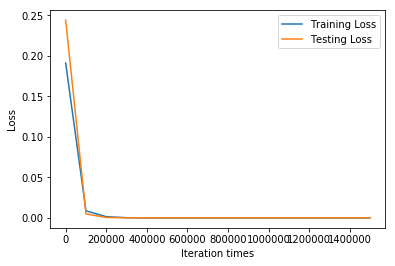
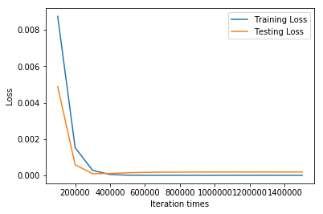
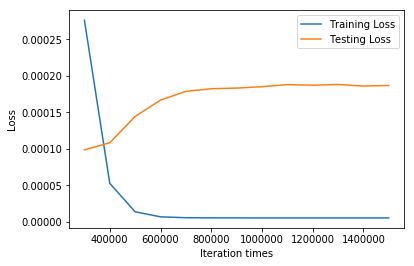
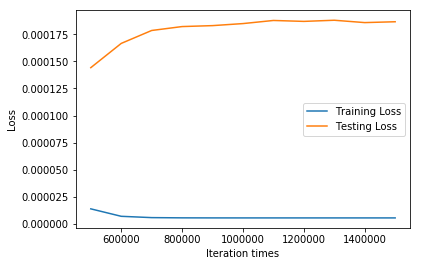

```python
import tensorflow as tf
import numpy as np
import matplotlib.pyplot as plt
from sklearn import preprocessing   

# Try to find value for W and b to compute y_data = x_data * W + b  

# Define dimensions
d = 2    # Size of the parameter space
N = 50 # Number of data sample

# Model parameters
W = tf.Variable(tf.zeros([d, 1], tf.float32), name="weights")
b = tf.Variable(tf.zeros([1], tf.float32), name="biases")

# Model input and output
x = tf.placeholder(tf.float32, shape=[None, d])
y = tf.placeholder(tf.float32, shape=[None, 1])

# hypothesis
linear_regression_model = tf.add(tf.matmul(x, W), b)
# cost/loss function
loss = tf.reduce_mean(tf.square(linear_regression_model - y))

# optimizer
optimizer = tf.train.GradientDescentOptimizer(learning_rate=0.00015)
train = optimizer.minimize(loss)

training_filename = "dataForTraining.txt"
testing_filename = "dataForTesting.txt"
training_dataset = np.loadtxt("dataForTraining.txt")
testing_dataset = np.loadtxt("dataForTesting.txt")

dataset = np.vstack((training_dataset,testing_dataset))
min_max_scaler = preprocessing.MinMaxScaler()  
dataset = min_max_scaler.fit_transform(dataset)

# x_train = np.array(training_dataset[:,:2])
# y_train = np.array(training_dataset[:,2:3])
# x_test = np.array(testing_dataset[:,:2])
# y_test = np.array(testing_dataset[:,2:3])
x_train = np.array(dataset[:50,:2])
y_train = np.array(dataset[:50,2:3])
x_test = np.array(dataset[50:,:2])
y_test = np.array(dataset[50:,2:3])
print(x_train.shape)
print(y_train.shape)

save_step_loss = {"step":[],"train_loss":[],"test_loss":[]}# 保存step和loss用于可视化操作

# mini_batch_size = 5
# n_batch = N // mini_batch_size + (N % mini_batch_size != 0)
# print(n_batch)

init = tf.global_variables_initializer()
with tf.Session() as sess:
    sess.run(init)  # reset values to wrong
    steps = 1500001
    for i in range(steps):
#         i_batch = (i % n_batch)*mini_batch_size
#         batch = x_train[i_batch:i_batch+mini_batch_size], y_train[i_batch:i_batch+mini_batch_size]
        random_index = np.random.choice(N)
        sess.run(train, {x: [x_train[random_index]], y:[y_train[random_index]]})
        if i % 100000 == 0:
            # evaluate training accuracy
            print("iteration times: %s" % i)
            curr_W, curr_b, curr_train_loss = sess.run([W, b, loss], {x: x_train, y: y_train})
            print("W: %s \nb: %s \nTrain Loss: %s" % (curr_W, curr_b, curr_train_loss))
            # Accuracy computation
            curr_test_loss = sess.run(loss,{x:x_test,y:y_test})
            print("Test Loss: %s\n" % curr_test_loss)
            save_step_loss["step"].append(i)
            save_step_loss["train_loss"].append(curr_train_loss)
            save_step_loss["test_loss"].append(curr_test_loss)

#画图损失函数变化曲线
plt.plot(save_step_loss["step"],save_step_loss["train_loss"],label='Training Loss')
plt.xlabel('Iteration times')
plt.ylabel('Loss (in billion RMB)')
plt.plot(save_step_loss["step"],save_step_loss["test_loss"],label='Testing Loss')
plt.legend()
plt.show()
#画图损失函数变化曲线
plt.plot(save_step_loss["step"][1:],save_step_loss["train_loss"][1:],label='Training Loss')
plt.xlabel('Iteration times')
plt.ylabel('Loss')
plt.plot(save_step_loss["step"][1:],save_step_loss["test_loss"][1:],label='Testing Loss')
plt.legend()
plt.show()
```

    (50, 2)
    (50, 1)
    iteration times: 0
    W: [[7.6930570e-05]
     [1.5155855e-05]] 
    b: [0.00020376] 
    Train Loss: 0.19121093
    Test Loss: 0.24404974
    
    iteration times: 100000
    W: [[ 0.44456542]
     [-0.60330117]] 
    b: [0.42725712] 
    Train Loss: 0.008744616
    Test Loss: 0.004878436
    
    iteration times: 200000
    W: [[ 0.6339395]
     [-0.8585454]] 
    b: [0.45152673] 
    Train Loss: 0.0015266079
    Test Loss: 0.0005829466
    
    iteration times: 300000
    W: [[ 0.71830094]
     [-0.96038145]] 
    b: [0.455777] 
    Train Loss: 0.00027605853
    Test Loss: 9.855314e-05
    
    iteration times: 400000
    W: [[ 0.7553407]
     [-1.0026609]] 
    b: [0.45744953] 
    Train Loss: 5.261896e-05
    Test Loss: 0.000108273656
    
    iteration times: 500000
    W: [[ 0.7706023]
     [-1.0203481]] 
    b: [0.4579283] 
    Train Loss: 1.3696611e-05
    Test Loss: 0.00014425819
    
    iteration times: 600000
    W: [[ 0.7770627]
     [-1.0277574]] 
    b: [0.45815083] 
    Train Loss: 6.80138e-06
    Test Loss: 0.00016669303
    
    iteration times: 700000
    W: [[ 0.7797208]
     [-1.0308493]] 
    b: [0.45831424] 
    Train Loss: 5.588443e-06
    Test Loss: 0.0001786401
    
    iteration times: 800000
    W: [[ 0.7807844]
     [-1.0320421]] 
    b: [0.45831782] 
    Train Loss: 5.374772e-06
    Test Loss: 0.0001822626
    
    iteration times: 900000
    W: [[ 0.7812789]
     [-1.0326409]] 
    b: [0.45829666] 
    Train Loss: 5.326182e-06
    Test Loss: 0.00018313536
    
    iteration times: 1000000
    W: [[ 0.7815941]
     [-1.0330446]] 
    b: [0.45833856] 
    Train Loss: 5.311727e-06
    Test Loss: 0.00018502337
    
    iteration times: 1100000
    W: [[ 0.78166544]
     [-1.0332083 ]] 
    b: [0.4584568] 
    Train Loss: 5.314094e-06
    Test Loss: 0.00018790245
    
    iteration times: 1200000
    W: [[ 0.781711 ]
     [-1.0333207]] 
    b: [0.45843157] 
    Train Loss: 5.31147e-06
    Test Loss: 0.00018704926
    
    iteration times: 1300000
    W: [[ 0.7817669]
     [-1.0333586]] 
    b: [0.45845923] 
    Train Loss: 5.313546e-06
    Test Loss: 0.00018810971
    
    iteration times: 1400000
    W: [[ 0.7817656]
     [-1.0333526]] 
    b: [0.45837572] 
    Train Loss: 5.3126982e-06
    Test Loss: 0.00018593672
    
    iteration times: 1500000
    W: [[ 0.7817609]
     [-1.0333897]] 
    b: [0.45841506] 
    Train Loss: 5.312364e-06
    Test Loss: 0.00018671407
    








```python
#画图损失函数变化曲线
plt.plot(save_step_loss["step"],save_step_loss["train_loss"],label='Training Loss')
plt.plot(save_step_loss["step"],save_step_loss["test_loss"],label='Testing Loss')
plt.xlabel('Iteration times')
plt.ylabel('Loss')
plt.legend()
plt.show()
#画图损失函数变化曲线
plt.plot(save_step_loss["step"][1:],save_step_loss["train_loss"][1:],label='Training Loss')
plt.plot(save_step_loss["step"][1:],save_step_loss["test_loss"][1:],label='Testing Loss')
plt.xlabel('Iteration times')
plt.ylabel('Loss')
plt.legend()
plt.show()
#画图损失函数变化曲线
plt.plot(save_step_loss["step"][3:],save_step_loss["train_loss"][3:],label='Training Loss')
plt.plot(save_step_loss["step"][3:],save_step_loss["test_loss"][3:],label='Testing Loss')
plt.xlabel('Iteration times')
plt.ylabel('Loss')
plt.legend()
plt.show()
#画图损失函数变化曲线
plt.plot(save_step_loss["step"][5:],save_step_loss["train_loss"][5:],label='Training Loss')
plt.plot(save_step_loss["step"][5:],save_step_loss["test_loss"][5:],label='Testing Loss')
plt.xlabel('Iteration times')
plt.ylabel('Loss')
plt.legend()
plt.show()

print('Train Loss:\n',save_step_loss["train_loss"])
print('')
print('Test Loss:\n',save_step_loss["test_loss"])
```














    Train Loss:
     [0.19121093, 0.008744616, 0.0015266079, 0.00027605853, 5.261896e-05, 1.3696611e-05, 6.80138e-06, 5.588443e-06, 5.374772e-06, 5.326182e-06, 5.311727e-06, 5.314094e-06, 5.31147e-06, 5.313546e-06, 5.3126982e-06, 5.312364e-06]
    
    Test Loss:
     [0.24404974, 0.004878436, 0.0005829466, 9.855314e-05, 0.000108273656, 0.00014425819, 0.00016669303, 0.0001786401, 0.0001822626, 0.00018313536, 0.00018502337, 0.00018790245, 0.00018704926, 0.00018810971, 0.00018593672, 0.00018671407]

