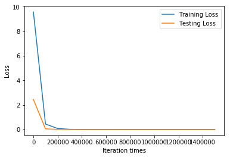
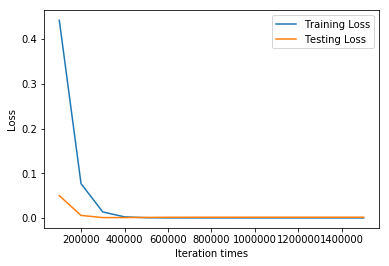
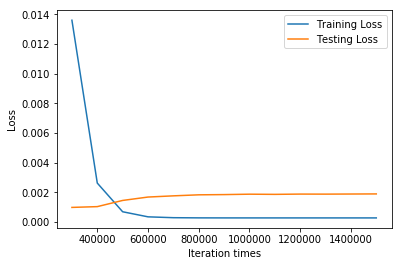
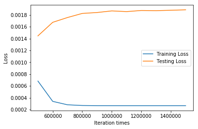

```python
import tensorflow as tf
import numpy as np
import matplotlib.pyplot as plt
from sklearn import preprocessing   

# Try to find value for W and b to compute y_data = x_data * W + b  

# Define dimensions
d = 2    # Size of the parameter space
N = 50 # Number of data sample

# Model parameters
W = tf.Variable(tf.zeros([d, 1], tf.float32), name="weights")
b = tf.Variable(tf.zeros([1], tf.float32), name="biases")

# Model input and output
x = tf.placeholder(tf.float32, shape=[None, d])
y = tf.placeholder(tf.float32, shape=[None, 1])

# hypothesis
linear_regression_model = tf.add(tf.matmul(x, W), b)
# cost/loss function
loss = tf.reduce_sum(tf.square(linear_regression_model - y))

# optimizer
optimizer = tf.train.GradientDescentOptimizer(learning_rate=0.00015)
train = optimizer.minimize(loss)

training_filename = "dataForTraining.txt"
testing_filename = "dataForTesting.txt"
training_dataset = np.loadtxt("dataForTraining.txt")
testing_dataset = np.loadtxt("dataForTesting.txt")

dataset = np.vstack((training_dataset,testing_dataset))
min_max_scaler = preprocessing.MinMaxScaler()  
dataset = min_max_scaler.fit_transform(dataset)

# x_train = np.array(training_dataset[:,:2])
# y_train = np.array(training_dataset[:,2:3])
# x_test = np.array(testing_dataset[:,:2])
# y_test = np.array(testing_dataset[:,2:3])
x_train = np.array(dataset[:50,:2])
y_train = np.array(dataset[:50,2:3])
x_test = np.array(dataset[50:,:2])
y_test = np.array(dataset[50:,2:3])
print(x_train.shape)
print(y_train.shape)

save_step_loss = {"step":[],"train_loss":[],"test_loss":[]}# 保存step和loss用于可视化操作

# mini_batch_size = 5
# n_batch = N // mini_batch_size + (N % mini_batch_size != 0)
# print(n_batch)

init = tf.global_variables_initializer()
with tf.Session() as sess:
    sess.run(init)  # reset values to wrong
    steps = 1500001
    for i in range(steps):
#         i_batch = (i % n_batch)*mini_batch_size
#         batch = x_train[i_batch:i_batch+mini_batch_size], y_train[i_batch:i_batch+mini_batch_size]
        random_index = np.random.choice(N)
        sess.run(train, {x: [x_train[random_index]], y:[y_train[random_index]]})
        if i % 100000 == 0:
            # evaluate training accuracy
            print("iteration times: %s" % i)
            curr_W, curr_b, curr_train_loss = sess.run([W, b, loss], {x: x_train, y: y_train})
            print("W: %s \nb: %s \nTrain Loss: %s" % (curr_W, curr_b, curr_train_loss))
            # Accuracy computation
            curr_test_loss = sess.run(loss,{x:x_test,y:y_test})
            print("Test Loss: %s\n" % curr_test_loss)
            save_step_loss["step"].append(i)
            save_step_loss["train_loss"].append(curr_train_loss)
            save_step_loss["test_loss"].append(curr_test_loss)

#画图损失函数变化曲线
plt.plot(save_step_loss["step"],save_step_loss["train_loss"],label='Training Loss')
plt.plot(save_step_loss["step"],save_step_loss["test_loss"],label='Testing Loss')
plt.xlabel('Iteration times')
plt.ylabel('Loss')
plt.legend()
plt.show()
#画图损失函数变化曲线
plt.plot(save_step_loss["step"][1:],save_step_loss["train_loss"][1:],label='Training Loss')
plt.plot(save_step_loss["step"][1:],save_step_loss["test_loss"][1:],label='Testing Loss')
plt.xlabel('Iteration times')
plt.ylabel('Loss')
plt.legend()
plt.show()
#画图损失函数变化曲线
plt.plot(save_step_loss["step"][3:],save_step_loss["train_loss"][3:],label='Training Loss')
plt.plot(save_step_loss["step"][3:],save_step_loss["test_loss"][3:],label='Testing Loss')
plt.xlabel('Iteration times')
plt.ylabel('Loss')
plt.legend()
plt.show()
#画图损失函数变化曲线
plt.plot(save_step_loss["step"][5:],save_step_loss["train_loss"][5:],label='Training Loss')
plt.plot(save_step_loss["step"][5:],save_step_loss["test_loss"][5:],label='Testing Loss')
plt.xlabel('Iteration times')
plt.ylabel('Loss')
plt.legend()
plt.show()

print('Train Loss:\n',save_step_loss["train_loss"])
print('')
print('Test Loss:\n',save_step_loss["test_loss"])
```

    (50, 2)
    (50, 1)
    iteration times: 0
    W: [[0.]
     [0.]] 
    b: [0.] 
    Train Loss: 9.5697155
    Test Loss: 2.4427087
    
    iteration times: 100000
    W: [[ 0.44367516]
     [-0.60045993]] 
    b: [0.42545658] 
    Train Loss: 0.44220608
    Test Loss: 0.050131258
    
    iteration times: 200000
    W: [[ 0.63352907]
     [-0.8578458 ]] 
    b: [0.4516036] 
    Train Loss: 0.07687889
    Test Loss: 0.005867483
    
    iteration times: 300000
    W: [[ 0.7188093]
     [-0.9608501]] 
    b: [0.4557397] 
    Train Loss: 0.013611701
    Test Loss: 0.00097511173
    
    iteration times: 400000
    W: [[ 0.7552315]
     [-1.0028976]] 
    b: [0.45727262] 
    Train Loss: 0.0026181408
    Test Loss: 0.0010275528
    
    iteration times: 500000
    W: [[ 0.7706382]
     [-1.0204084]] 
    b: [0.4579417] 
    Train Loss: 0.0006814125
    Test Loss: 0.0014455966
    
    iteration times: 600000
    W: [[ 0.7771091]
     [-1.0278238]] 
    b: [0.4581783] 
    Train Loss: 0.0003383949
    Test Loss: 0.0016744689
    
    iteration times: 700000
    W: [[ 0.779663 ]
     [-1.0307382]] 
    b: [0.45819142] 
    Train Loss: 0.0002806878
    Test Loss: 0.0017554929
    
    iteration times: 800000
    W: [[ 0.78081125]
     [-1.0319928 ]] 
    b: [0.45830616] 
    Train Loss: 0.0002688958
    Test Loss: 0.001824941
    
    iteration times: 900000
    W: [[ 0.7812952]
     [-1.032626 ]] 
    b: [0.45832145] 
    Train Loss: 0.00026624338
    Test Loss: 0.001840225
    
    iteration times: 1000000
    W: [[ 0.781441]
     [-1.03299 ]] 
    b: [0.45844987] 
    Train Loss: 0.00026582208
    Test Loss: 0.0018675847
    
    iteration times: 1100000
    W: [[ 0.78163546]
     [-1.0332049 ]] 
    b: [0.45837894] 
    Train Loss: 0.00026558578
    Test Loss: 0.0018558321
    
    iteration times: 1200000
    W: [[ 0.78174996]
     [-1.0333698 ]] 
    b: [0.4584428] 
    Train Loss: 0.00026560854
    Test Loss: 0.0018744892
    
    iteration times: 1300000
    W: [[ 0.78175914]
     [-1.0333457 ]] 
    b: [0.45842263] 
    Train Loss: 0.00026557158
    Test Loss: 0.0018714336
    
    iteration times: 1400000
    W: [[ 0.78176856]
     [-1.0333742 ]] 
    b: [0.45845258] 
    Train Loss: 0.0002656439
    Test Loss: 0.0018786299
    
    iteration times: 1500000
    W: [[ 0.78182465]
     [-1.0334235 ]] 
    b: [0.45846984] 
    Train Loss: 0.0002657702
    Test Loss: 0.0018858849
    














    Train Loss:
     [9.5697155, 0.44220608, 0.07687889, 0.013611701, 0.0026181408, 0.0006814125, 0.0003383949, 0.0002806878, 0.0002688958, 0.00026624338, 0.00026582208, 0.00026558578, 0.00026560854, 0.00026557158, 0.0002656439, 0.0002657702]
    
    Test Loss:
     [2.4427087, 0.050131258, 0.005867483, 0.00097511173, 0.0010275528, 0.0014455966, 0.0016744689, 0.0017554929, 0.001824941, 0.001840225, 0.0018675847, 0.0018558321, 0.0018744892, 0.0018714336, 0.0018786299, 0.0018858849]

