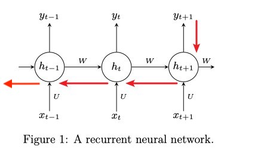
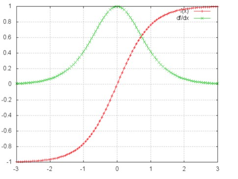

# Homework 3: Recurrent Neural Networks

**Student Name:**

**Student ID:**

## Exercise 1 : Backpropagation through Time

### (a)

我们假设输入向量 x 的维度是 d ，输出向量 y 的维度是 n，则矩阵 W 的维度是 $n \times d$ ，下面是展开成矩阵的样子，看起来更直观一些：
$$
\begin{align}
\begin{bmatrix}
y_1\\
y_2\\
.\\.\\
y_n\\
\end{bmatrix}= \sigma(
\begin{bmatrix}
w_{11} w_{12} ... w_{1d}\\
w_{21} w_{22} ... w_{2d}\\
.\\.\\
w_{n1} w_{n2} ... w_{nd}\\
\end{bmatrix}
\begin{bmatrix}
x_1\\
x_2\\
.\\.\\
x_d\\
\end{bmatrix})
\end{align}
$$
---

令 t = Wx ，则
$$
\begin{align}
\begin{bmatrix}
t_1\\
t_2\\
.\\.\\
t_n\\
\end{bmatrix}=
\begin{bmatrix}
w_{11}x_1 + w_{12}x_2 + ... w_{1d}x_d\\
w_{21}x_1 + w_{22}x_2 + ... w_{2d}x_d\\
.\\.\\
w_{n1}x_1 + w_{n2}x_2 + ... w_{nd}x_d\\
\end{bmatrix}
\end{align}
$$
$$
\begin{align}
\begin{bmatrix}
y_1\\
y_2\\
.\\.\\
y_n\\
\end{bmatrix}=
\begin{bmatrix}
\sigma{(t_1)}\\
\sigma{(t_2)}\\
.\\.\\
\sigma{(t_n)}\\
\end{bmatrix}
\end{align}
$$
---
根据链式法则，得到下式：

$$
\begin{align}
\frac{\partial{y}}{\partial{x}}&= \frac{\partial{y}}{\partial{t}}\frac{\partial{t}}{\partial{x}}
\end{align}
$$

等式右边第一项是向量函数对向量求导，其结果为 Jacobian 矩阵：
$$
\begin{align}
\frac{\partial{y}}{\partial{t}}&=
\begin{bmatrix}
\frac{\partial{y_1}}{\partial{t_1}}& \frac{\partial{y_1}}{\partial{t_2}}& ...&  \frac{\partial{y_1}}{\partial{t_n}}\\
\frac{\partial{y_2}}{\partial{t_1}}& \frac{\partial{y_2}}{\partial{t_2}}& ...&  \frac{\partial{y_2}}{\partial{t_n}}\\
&.\\&.\\
\frac{\partial{y_n}}{\partial{t_1}}& \frac{\partial{y_n}}{\partial{t_2}}& ...&  \frac{\partial{y_n}}{\partial{t_n}}\\
\end{bmatrix}\\
&=\begin{bmatrix}
\sigma'(t_1) & 0 & ... & 0\\
0 & \sigma'(t_2) & ... & 0\\
&.\\&.\\
0 & 0 & ... & \sigma'(t_n)\\
\end{bmatrix}\\
&=diag[\sigma'{(t)}]
\end{align}
$$

其中，diag[a] 表示根据向量 a 创建一个对角矩阵，即：

$$
diag(\mathrm{a})=\begin{bmatrix}
a_1 & 0 & ... & 0\\
0 & a_2 & ... & 0\\
&.\\&.\\
0 & 0 & ... & a_n\\
\end{bmatrix}\\
$$
同理，上式第二项也是一个 Jacobian 矩阵：
$$
\begin{align}
\frac{\partial{t}}{\partial{x}}&=
\begin{bmatrix}
\frac{\partial{t_1}}{\partial{x_1}}& \frac{\partial{t_1}}{\partial{x_2}}& ...&  \frac{\partial{t_1}}{\partial{x_d}}\\
\frac{\partial{t_2}}{\partial{x_1}}& \frac{\partial{t_2}}{\partial{x_2}}& ...&  \frac{\partial{t_2}}{\partial{x_d}}\\
&.\\&.\\
\frac{\partial{t_n}}{\partial{x_1}}& \frac{\partial{t_n}}{\partial{x_2}}& ...&  \frac{\partial{t_n}}{\partial{x_d}}\\
\end{bmatrix}\\
&=\begin{bmatrix}
w_{11} & w_{12} & ... & w_{1d}\\
w_{21} & w_{22} & ... & w_{2d}\\
&.\\&.\\
w_{n1} & w_{n2} & ... & w_{nd}\\
\end{bmatrix}\\
&=W
\end{align}
$$
最后，将两项合在一起，可得：
$$
\frac{\partial{y}}{\partial{x}} = diag(\sigma') W
$$

------

### (b)

此步是 BPTT  算法的最后一步：计算共享权重的梯度。

根据 （a）中结果，可以得到**循环层任意时刻 t 的输出 $h_t$** 对**循环层初始时刻的输入 $h_0$** 的偏导为：
$$
\begin{align}\frac{\partial{h_t}}{\partial{h_0}}=&\frac{\partial{h_t}}{\partial{h_{t-1}}}\frac{\partial{h_{t-1}}}{\partial{h_{t-2}}}...\frac{\partial{h_1}}{\partial{h_0}}
\\=&\prod_{i=1}^{t}\frac{\partial{h_i}}{\partial{h_{i-1}}}
\\=&\prod_{i=1}^{t}diag[\sigma'(\mathrm{Wh_{i-1}+Ux_i})]W
\end{align}
$$

因为 $L_t$ 是在时刻 t 的标量损失值，和循环层输出 $h_t$ 有关，假设时间序列为三段， t1，t2 和 t3，因为 $h_t$ 随着时间序列向前传播，而 $h_t$ 又是 W 的函数，所以对 W 求偏导为：
$$
\begin{align}
\frac{\partial{L_3}}{\partial{W}}
=&\frac{\partial{L_3}}{\partial{h_3}}\frac{\partial{h_3}}{\partial{W}} \ 
+ \ \frac{\partial{L_3}}{\partial{h_3}}\frac{\partial{h_3}}{\partial{h_2}}\frac{\partial{h_2}}{\partial{W}} \
+ \ \frac{\partial{L_3}}{\partial{h_3}}\frac{\partial{h_3}}{\partial{h_2}}\frac{\partial{h_2}}{\partial{h_1}}\frac{\partial{h_1}}{\partial{W}} 
+ \ \frac{\partial{L_3}}{\partial{h_3}}\frac{\partial{h_3}}{\partial{h_2}}\frac{\partial{h_2}}{\partial{h_1}}\frac{\partial{h_1}}{\partial{h_0}}\frac{\partial{h_0}}{\partial{W}} \\
=&\sum_{k=0}^{3}\frac{\partial{L_3}}{\partial{h_3}}\frac{\partial{h_3}}{\partial{h_k}}\frac{\partial{h_k}}{\partial{W}} \\
\end{align}
$$

所以对于任意时刻 t：
$$
\begin{align}
\frac{\partial{L_t}}{\partial{W}}
=&\sum_{k=0}^{t}\frac{\partial{L_t}}{\partial{h_t}}\frac{\partial{h_t}}{\partial{h_k}}\frac{\partial{h_k}}{\partial{W}} \\
\end{align}
$$
因为 $L = \sum_{t=0}^{T}L_t​$ ，所以：
$$
\begin{align}
\frac{\partial{L}}{\partial{W}}
=&\sum_{t=0}^{T}\sum_{k=0}^{t}\frac{\partial{L_t}}{\partial{h_t}}\frac{\partial{h_t}}{\partial{h_k}}\frac{\partial{h_k}}{\partial{W}} \\
\end{align}
$$

------

下面表示成矩阵形式：

令 $s_t=Wh_{t-1}+Ux_t$ ，展开成矩阵形式为：
$$
\begin{align}
\begin{bmatrix}
s_1^t\\
s_2^t\\
.\\.\\
s_n^t\\
\end{bmatrix}=&U\mathrm{x}_t+
\begin{bmatrix}
w_{11} & w_{12} & ... & w_{1n}\\
w_{21} & w_{22} & ... & w_{2n}\\
.\\.\\
w_{n1} & w_{n2} & ... & w_{nn}\\
\end{bmatrix}
\begin{bmatrix}
h_1^{t-1}\\
h_2^{t-1}\\
.\\.\\
h_n^{t-1}\\
\end{bmatrix}\\
=&U\mathrm{x}_t+
\begin{bmatrix}
w_{11}h_1^{t-1}+w_{12}h_2^{t-1}...+w_{1n}h_n^{t-1}\\
w_{21}h_1^{t-1}+w_{22}h_2^{t-1}...+w_{2n}h_n^{t-1}\\
.\\.\\
w_{n1}h_1^{t-1}+w_{n2}h_2^{t-1}...+w_{nn}h_n^{t-1}\\
\end{bmatrix}\\
\end{align}
$$
其中下标表示它是这个向量的第几个元素，它的上标表示第几个**时刻**。例如，$s_j^t​$ 表示向量 s 的第 j 个元素在 t 时刻的值。$w_{ji}​$ 表示**循环层**第 t-1 时刻的第 i 个神经元到**循环层**第 t 个时刻的第 j 个神经元的权重。

因为对 W 求导与 $U\mathrm{x}_t$ 无关，我们不再考虑。现在，根据链式法则，我们考虑在 t 时刻的损失 $L_t$ 对权重项 $w_{ji}​$ 求导：
$$
\begin{align}
\frac{\partial{L_t}}{\partial{w_{ji}}}
=&\frac{\partial{L_t}}{\partial{h_j^t}}\frac{\partial{h_j^t}}{\partial{s_j^t}}\frac{\partial{s_j^t}}{\partial{w_{ji}}}\\
=&\frac{\partial{L_t}}{\partial{h_j^t}}\sigma'(s_j^t)h_i^{t-1}
\end{align}
$$
上述中我们将 $h_i^{t-1}$ 视为前向传播计算的上一循环层的输出值，而不是一个函数，令：
$$
\delta_j^t = \frac{\partial{L_t}}{\partial{h_j^t}}
$$
则按照上面的规律生成时刻为 t 时的梯度方阵为：
$$
\begin{align}
\frac{\partial{L_t}}{\partial{W}}=&
\begin{bmatrix}
\delta_1^t\sigma'(s_1^t)h_1^{t-1} & \delta_1^t\sigma'(s_1^t)h_2^{t-1} & ... &  \delta_1^t\sigma'(s_1^t)h_n^{t-1}\\
\delta_2^t\sigma'(s_2^t)h_1^{t-1} & \delta_2^t\sigma'(s_2^t)h_2^{t-1} & ... &  \delta_2^t\sigma'(s_2^t)h_n^{t-1}\\
.\\.\\
\delta_n^t\sigma'(s_n^t)h_1^{t-1} & \delta_n^t\sigma'(s_n^t)h_2^{t-1} & ... &  \delta_n^t\sigma'(s_n^t)h_n^{t-1}\\
\end{bmatrix}
\end{align}
$$
最终的梯度是各个时刻的梯度**之和**：
$$
\begin{align}
\frac{\partial{L}}{\partial{W}}
=&\sum_{t=1}^{T} 
\begin{bmatrix}
\delta_1^t\sigma'(s_1^t)h_1^{t-1} & \delta_1^t\sigma'(s_1^t)h_2^{t-1} & ... &  \delta_1^t\sigma'(s_1^t)h_n^{t-1}\\
\delta_2^t\sigma'(s_2^t)h_1^{t-1} & \delta_2^t\sigma'(s_2^t)h_2^{t-1} & ... &  \delta_2^t\sigma'(s_2^t)h_n^{t-1}\\
.\\.\\
\delta_n^t\sigma'(s_n^t)h_1^{t-1} & \delta_n^t\sigma'(s_n^t)h_2^{t-1} & ... &  \delta_n^t\sigma'(s_n^t)h_n^{t-1}\\
\end{bmatrix}\\
\end{align}
$$

------

## Exercise 2: Vanishing/Exploding Gradients in RNNs

### (a)

当 T = 3 时：
$$
\frac{\partial{L_1}}{\partial{W}} 
=\frac{\partial{L_1}}{\partial{h_1}}\frac{\partial{h_1}}{\partial{W}} + \frac{\partial{L_1}}{\partial{h_1}}\frac{\partial{h_1}}{\partial{h_0}}\frac{\partial{h_0}}{\partial{W}}\\
$$

$$
\frac{\partial{L_2}}{\partial{W}} 
=\frac{\partial{L_2}}{\partial{h_2}}\frac{\partial{h_2}}{\partial{W}} + \frac{\partial{L_2}}{\partial{h_2}}\frac{\partial{h_2}}{\partial{h_1}}\frac{\partial{h_1}}{\partial{W}} + \frac{\partial{L_2}}{\partial{h_2}}\frac{\partial{h_2}}{\partial{h_1}}\frac{\partial{h_1}}{\partial{h_0}}\frac{\partial{h_0}}{\partial{W}}
$$

$$
\frac{\partial{L_3}}{\partial{W}}
=\frac{\partial{L_3}}{\partial{h_3}}\frac{\partial{h_3}}{\partial{W}} \ 
+ \ \frac{\partial{L_3}}{\partial{h_3}}\frac{\partial{h_3}}{\partial{h_2}}\frac{\partial{h_2}}{\partial{W}} \
+ \ \frac{\partial{L_3}}{\partial{h_3}}\frac{\partial{h_3}}{\partial{h_2}}\frac{\partial{h_2}}{\partial{h_1}}\frac{\partial{h_1}}{\partial{W}}\ +\ \frac{\partial{L_3}}{\partial{h_3}}\frac{\partial{h_3}}{\partial{h_2}}\frac{\partial{h_2}}{\partial{h_1}}\frac{\partial{h_1}}{\partial{h_0}}\frac{\partial{h_0}}{\partial{W}}
$$

又因为：（**见 Ex1(b)**）
$$
\begin{align}\frac{\partial{h_t}}{\partial{h_0}}=&\frac{\partial{h_t}}{\partial{h_{t-1}}}\frac{\partial{h_{t-1}}}{\partial{h_{t-2}}}...\frac{\partial{h_1}}{\partial{h_0}}
\\=&\prod_{i=1}^{t}\frac{\partial{h_i}}{\partial{h_{i-1}}}
\\=&\prod_{i=1}^{t}diag[\sigma'(\mathrm{Wh_{i-1}+Ux_i})]W
\end{align}
$$
所以：
$$
\begin{align}
\frac{\partial{L}}{\partial{W}}
=&\frac{\partial{L_0}}{\partial{W}}+\frac{\partial{L_1}}{\partial{W}}+\frac{\partial{L_2}}{\partial{W}}+\frac{\partial{L_3}}{\partial{W}} \\
=&\frac{\partial{L_1}}{\partial{W}}+\frac{\partial{L_2}}{\partial{W}}+\frac{\partial{L_3}}{\partial{W}} \\
\end{align}
$$
**当 T = 3 时，在计算 $L_3$ 对 W 的偏导时，需要将误差项沿着循环层反向传递三层直到初始时刻，相应的，上述展开的第三项包括了对 $diag(\sigma') W$ 的三次幂运算。**

------

### (b)

使用数学归纳法证明如下

当 n = 1时，根据定义
$$
M=Q\Lambda Q^{-1}
$$
当 n = k 时，假设
$$
M^k=Q\Lambda^{k} Q^{-1}
$$
当 n = k+1 时，因为 $Q^{-1}Q = I$，且 $\Lambda$ 是对角矩阵，所以
$$
M^{k+1}= M^kM = (Q\Lambda^{k} Q^{-1})(Q\Lambda Q^{-1}) = (Q\Lambda^{k} Q^{-1}Q\Lambda Q^{-1}) = Q\Lambda^{k+1}Q^{-1}
$$
$M^n=Q\Lambda^{n} Q^{-1}$ 得证。

------

### (c)

根据 Ex2 (b)：
$$
\begin{align}
W^{30} = Q\Lambda^{30}Q{-1} =& \begin{bmatrix} -0.6 & -0.8 \\ -0.8 & 0.6 \end{bmatrix} \begin{bmatrix} 0.9 & 0 \\ 0 & 0.4 \end{bmatrix}^{30} \begin{bmatrix} -0.6 & -0.8 \\ -0.8 & 0.6 \end{bmatrix} \\
=& \begin{bmatrix} -0.6 & -0.8 \\ -0.8 & 0.6 \end{bmatrix} \begin{bmatrix} 0.0424 & 0 \\ 0 & 1.153e-12  \end{bmatrix}^{30} \begin{bmatrix} -0.6 & -0.8 \\ -0.8 & 0.6 \end{bmatrix} \\
=&\begin{bmatrix} 0.0153 & 0.0203 \\ 0.0203 & 0.0271 \end{bmatrix}
\end{align}
$$
发现权重矩阵中各个元素逐渐趋近于零，说明当矩阵 W 的**所有特征值的绝对值小于 1 时**，即对角矩阵 $\Lambda$ 的对角元素的绝对值全部小于 1 时，矩阵的幂趋向于 0，并以指数速度减少；当 W 的**任意一个特征值的绝对值大于 1 时**，矩阵的幂趋向于无穷，并以指数速度增加；当 W 的所有特征值等于 1 时，矩阵的幂和原矩阵相同。此结果和过程可以通过 Matlab 计算矩阵二范数关于指数阶次的函数图像发现。

至此我们可以解释传统 rnn 中梯度消失和梯度爆炸的原因：

当完成前向计算并得到误差项后，BPTT 会将其沿着时间线传递到初始时刻，从而计算每个循环层的共享权重的梯度，根据 Ex2 (a) 中的公式。当时间线较长时，离当前时刻较远的梯度中 $diag(\sigma') W$ 会进行高阶的幂运算，如果可对角化方阵 $diag(\sigma') W$ 的所有特征值的绝对值是一个大于 0 小于 1 的值，则当 t 很大时，  $diag(\sigma') W$  的幂会趋向于0，导致此项梯度消失；如果 $diag(\sigma') W$ 的其中一个特征值的绝对值一个大于 1，$diag(\sigma') W$ 的幂会趋向于无穷，导致此项梯度爆炸，这点和以 $diag(\sigma') W$  的特征值为底的指数函数性质相同。因为 $\sigma'$ 的值域为 (0,1/4) ，所以每乘以一次 sigmoid 的导数值都会让后向传播的梯度衰减一次，需要靠矩阵 W 拉回来，但是如果拉得过头了又会导致梯度爆炸。

但 **RNN 中总的梯度是不会消失的**。只是训练时梯度不能在较长序列中一直传递下去，**梯度被近距离梯度主导，导致模型难以学到远距离的依赖关系吗，从而使 RNN 无法捕捉到长距离的影响**。

------

## Exercise 3: LSTMs

### (a)

原始 RNN 的隐藏层只有一个状态，即 h，它对于短期的输入非常敏感。LSTM 增加一个状态，即 c，称为**单元状态(cell state)**，让它来保存长期的状态。

在 t 时刻，LSTM 的输入有三个：

- 当前时刻网络的输入值 $\mathbf{x}_t​$
- 上一时刻 LSTM 的输出值 $\mathbf{h}_{t-1}$
- 上一时刻的单元状态 $\mathbf{c}_{t-1}​$ 

LSTM 的输出有两个：

- 当前时刻 LSTM 输出值 $\mathbf{h}_t​$
- 和当前时刻的单元状态 $\mathbf{c}_t$

LSTM 的关键，就是怎样控制长期状态 c。在这里，LSTM 的思路是使用三个门（gate），**门实际上就是一层全连接层，它的输入是一个向量，输出是一个0到1之间的实数向量。**一般使用 $\sigma$ （也就是 sigmoid 函数），因为它的值域是(0,1)。三个门的输入分别有六个不同的权重矩阵 W，每个门各两个 W，分别将维度是 $d_h$ 的隐层向量 $h_{t-1}$ 和维度是 $d_x$ 的输入向量 $x_t$ 映射到维度是 $d_c$ 的单元状态向量 $c_t$。

其中的 $f_t$ 就是**遗忘门（forget gate）**，它决定了上一时刻的单元状态 $\mathbf{c}_{t-1}$ 有多少保留到当前时刻 $\mathbf{c}_t$

$i_t$ 是**输入门（input gate）**，它决定了当前时刻网络的输入 $\mathbf{x}_t$ 有多少保存到单元状态 $\mathbf{c}_t$

$o_t$ 是**输出门（output gate）**，用来控制单元状态 $\mathbf{c}_t$ 有多少输出到 LSTM 的当前输出值 $\mathbf{h}_t$。

最后，用门的输出向量点乘需要控制的那个向量，即可得到 LSTM 的输出。
$$
\begin{align}
\mathbf{C}_t=f_t\odot{\mathbf{C}_{t-1}}+i_t\odot{\mathbf{\tilde{C}}_t}\\
\mathbf{h}_t=o_t\odot{\mathbf{tanh(C_t)}}
\end{align}
$$

------

### (b)

三个门输出的向量总为正，因为激活函数 sigmoid 的值域为 (0,1)。

下图为 tanh 的函数图像和其导数图像，其值域分别为 (-1,1) 和 (0,1)。且对于原函数，输入和输出同号。

所以在正向传播时，${\mathbf{\tilde{C}}_t}$ 的输出可能为负，导致 $\mathbf{C}_t$ 也可能为负，最终的 $\mathbf{h}_t$ 也和 $\mathbf{C}_t$ 同号。

------

### (c)

因为：
$$
\frac{\partial C_t}{\partial C_k} = \prod_{i=k+1}^t \frac{\partial C_i}{\partial C_{i-1}}.
$$
且对于所有 t：
$$
C_t = C_{t-1}
$$
所以：
$$
\frac{\partial C_t}{\partial C_k} = 1
$$

> **LSTM 中梯度的传播有很多条路径**， 这条路径上只有逐元素相乘和相加的操作，梯度流最稳定；但是其他路径（例如  ）上梯度流与普通 RNN 类似，照样会发生相同的权重矩阵反复连乘。
> **LSTM 刚提出时没有遗忘门**，或者说相当于  ，这时候在  直接相连的短路路径上， 可以无损地传递给  ，从而**这条路径**上的梯度畅通无阻，不会消失。类似于 ResNet 中的残差连接。
> 其一是遗忘门接近 1（例如模型初始化时会把 forget bias 设置成较大的正数，让遗忘门饱和），这时候远距离梯度不消失；其二是**遗忘门接近 0，但这时模型是故意阻断梯度流的，这不是 bug 而是 feature**（例如情感分析任务中有一条样本 “A，但是 B”，模型读到“但是”后选择把遗忘门设置成 0，遗忘掉内容 A，这是合理的）。当然，常常也存在 f 介于 [0, 1] 之间的情况，在这种情况下只能说 LSTM 改善（而非解决）了梯度消失的状况。
>
> From: https://www.zhihu.com/question/34878706/answer/665429718

